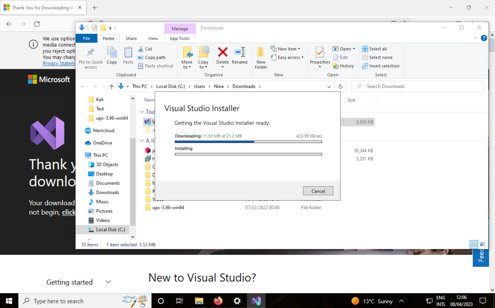
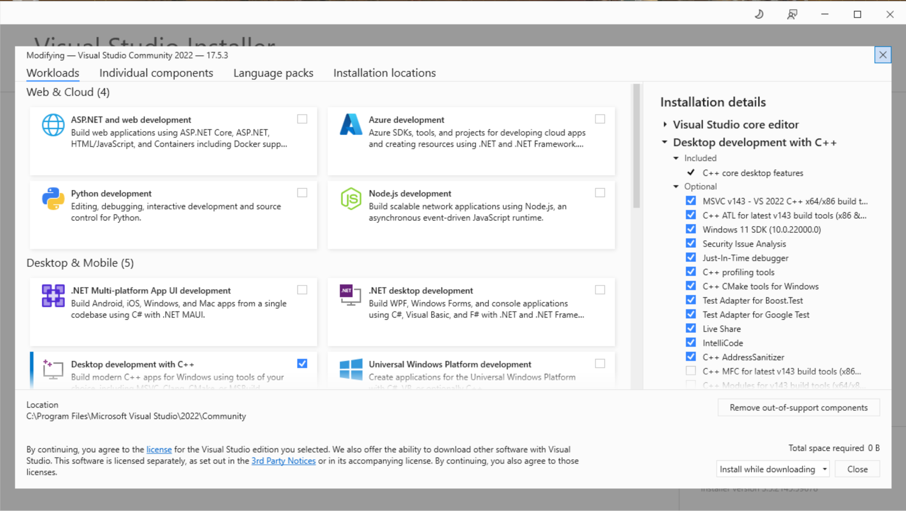
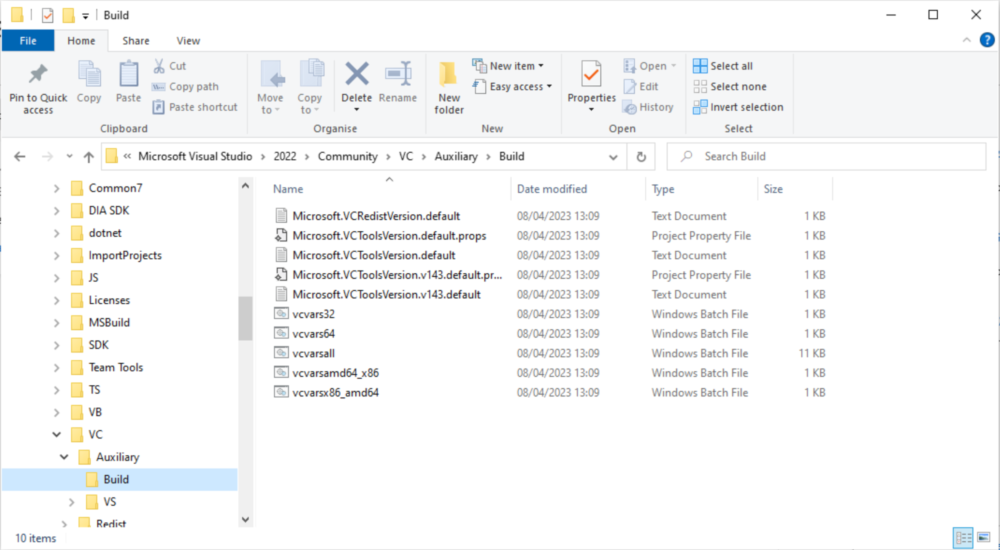
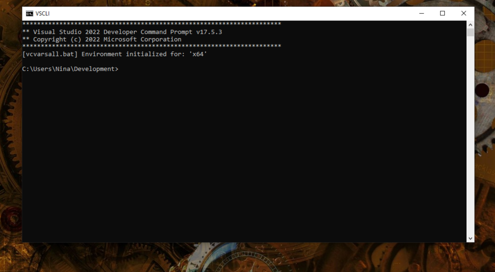
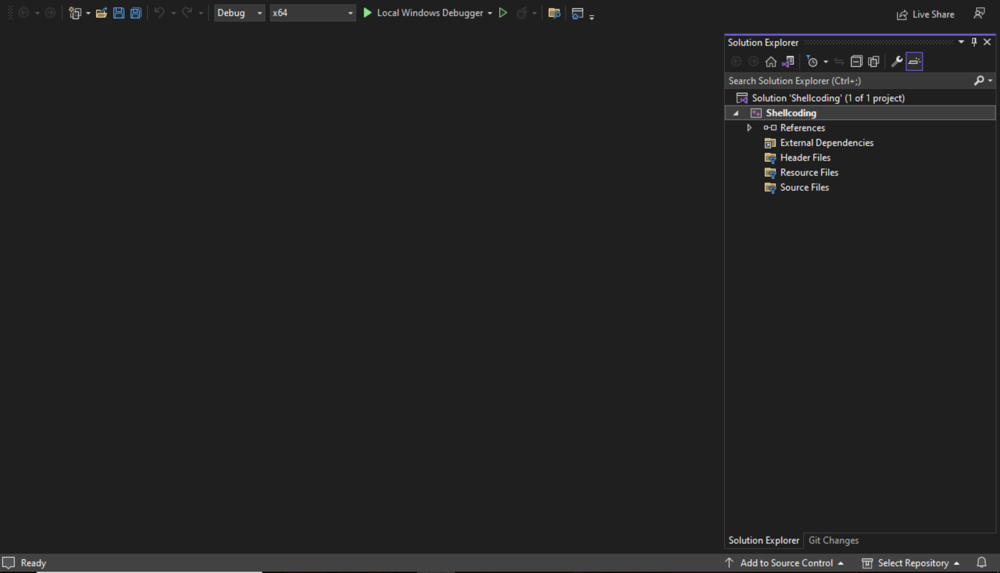
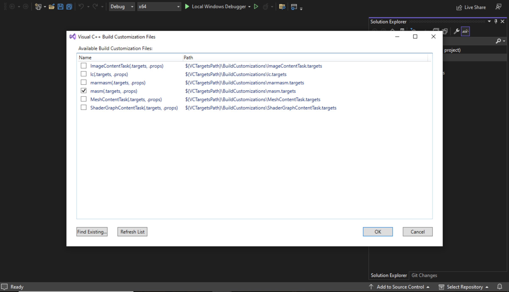
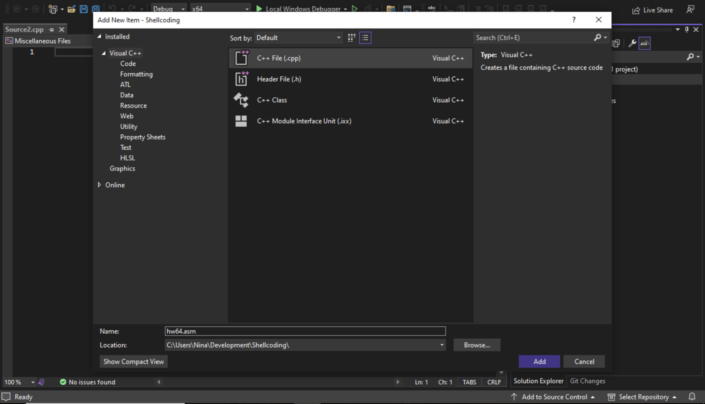

# Microsoft Assembler on Windows 10 with Visual Studio Community

Developing shells for Windows is best done on Windows. MASM is not available as a separate application. To make use of this assembler, Visual Studio needs to be installed. 

## Install VSCode

At the time of writing, the Visual Studio Community edition for Windows can be found at https://visualstudio.microsoft.com/vs/community/. If no longer true, do a web-based search for Microsoft Visual Studio.



When setting it up, choose the Microsoft Visual C++ desktop tools.



## Create a CLI prompt for MASM

To use the Microsoft Visual C++ (MSVC) compiler and MASM, initialise the environment by using a batch file provided by Visual Studio and then leave the command line interpreter (CLI) open for building and running programs.

1. Find the batch file named `vcvars64.bat` (or something similar). I found the `vcvars64.bat` file in: `C:\Program Files\Microsoft Visual Studio\2022\Community\VC\Auxiliary\Build\`.



Note: `vcvars.bat` or `vcvars32.bat` will not work (these set up the environment variables for the 32-bit version of the assembler and C++ compiler).

2. Create a shortcut to `vcvars64.bat` on the Desktop. Rename it to something sensible like `VSCLI`.
3. Right-click the shortcut icon on the desktop and click **Properties -> Shortcut**. Find the **Target** text box that contains the path to the `vcvars64.bat` file and add the prefix `cmd /k` in front of this path:

```text
cmd /k "C:\Program Files\Microsoft Visual Studio\2022\Community\VC\Auxiliary\Build\vcvars64.bat"
```

The `/k` option tells `cmd.exe` to execute the command that follows and then leave the window open when the command finishes execution.

Now, when double-clicking the shortcut icon on the desktop, it will initialise all the environment variables and leave the command window open for using execute the Visual Studio tools (like MASM and MSVC) from the command line.

4. Before closing the **Properties** dialog, modify the **Start In** text box to contain `C:\` or another directory where you will normally be working when first starting the Visual Studio command line tools. I chose:

```text
C:\Users\Nina\Development
```

5. Double-click on the icon:



On the command line, type `ml64`. This should produce output similar to:

```text
C:\Users\Nina\Development>ml64
Microsoft (R) Macro Assembler (x64) Version 14.35.32216.1
Copyright (C) Microsoft Corporation.  All rights reserved.

usage: ML64 [ options ] filelist [ /link linkoptions]
Run "ML64 /help" or "ML64 /?" for more info
```

This message means that `ml64.exe` is in the execution path, so the system has properly set up the environment variables to run the Microsoft Macro Assembler.

6. Execute the `cl` command to verify being able to run `MSVC`.

```text
C:\Users\Nina\Development>cl
Microsoft (R) C/C++ Optimizing Compiler Version 19.35.32216.1 for x64
Copyright (C) Microsoft Corporation.  All rights reserved.

usage: cl [ option... ] filename... [ /link linkoption... ]
```

7. Locate the Visual Studio application in the **Start** menu. Click it and verify that this brings up the Visual Studio IDE. I made a shortcut on the Desktop for that too.

## Editing, assembling, and running a MASM source file

1. Launch Visual Studio and create an **Empty Project (C++)**. It will ask for a project name and for setting a path. 



2. In the solution explorer right-click on the project name, navigate to **Build Dependencies -> Build Customizations**. Check **masm**, and click **OK**. 



3. Right-click on the project name again, navigate to **Add -> New item**, choose the `c++` template, and at the bottom change the name of the file to, for example `hw64.asm`, then **Add** to the project.



Add some code:

```text
includelib kernel32.lib
        extrn __imp_GetStdHandle:proc
        extrn __imp_WriteFile:proc
    
        .CODE

hwStr   byte    "Hello World!"
hwLen   =       $-hwStr
main    PROC

; On entry, stack is aligned at 8 mod 16. Setting aside 8
; bytes for "bytesWritten" ensures that calls in main have
; their stack aligned to 16 bytes (8 mod 16 inside function).

lea     rbx, hwStr
sub     rsp, 8
mov     rdi, rsp    ; Hold # of bytes written here

; Note: must set aside 32 bytes (20h) for shadow registers for
; parameters (just do this once for all functions).
; Also, WriteFile has a 5th argument (which is NULL),
; so we must set aside 8 bytes to hold that pointer (and
; initialize it to zero). Finally, the stack must always be
; 16-byte-aligned, so reserve another 8 bytes of storage
; to ensure this.

; Shadow storage for args (always 30h bytes).

sub     rsp, 030h

; Handle = GetStdHandle(-11);
; Single argument passed in ECX.
; Handle returned in RAX.

mov     rcx, -11    ; STD_OUTPUT
call    qword ptr __imp_GetStdHandle

; WriteFile(handle, "Hello World!", 12, &bytesWritten, NULL);
; Zero out (set to NULL) "LPOverlapped" argument:

        mov     qword ptr [rsp + 4 * 8], 0  ; 5th argument on stack

        mov     r9, rdi     ; Address of "bytesWritten" in R9
        mov     r8d, hwLen  ; Length of string to write in R8D
        lea     rdx, hwStr  ; Ptr to string data in RDX
        mov     rcx, rax    ; File handle passed in RCX
        call    qword ptr __imp_WriteFile
        add     rsp, 38h
        ret
main    ENDP
        END
```

4. In the CLI window, assemble:

```text
C:\Users\Nina\Development\Shellcoding>ml64 hw64.asm /link /subsystem:console /entry:main
Microsoft (R) Macro Assembler (x64) Version 14.35.32216.1
Copyright (C) Microsoft Corporation.  All rights reserved.

 Assembling: hw64.asm
Microsoft (R) Incremental Linker Version 14.35.32216.1
Copyright (C) Microsoft Corporation.  All rights reserved.

/OUT:hw64.exe
hw64.obj
/subsystem:console
/entry:main

C:\Users\Nina\Development\Shellcoding>
```

5. Run the `hw64.exe` output file that this assembly produces by typing the command `hw64` at the command line prompt:

```text
C:\Users\Nina\Development\Shellcoding>hw64
Hello World!
```

## Create a project template

In the top menu of the just created project, navigate to **Project -> Export Template**.

Now all that's needed to do build an assembly project is to create a new project in visual studio and look up the template name in the search bar. 


