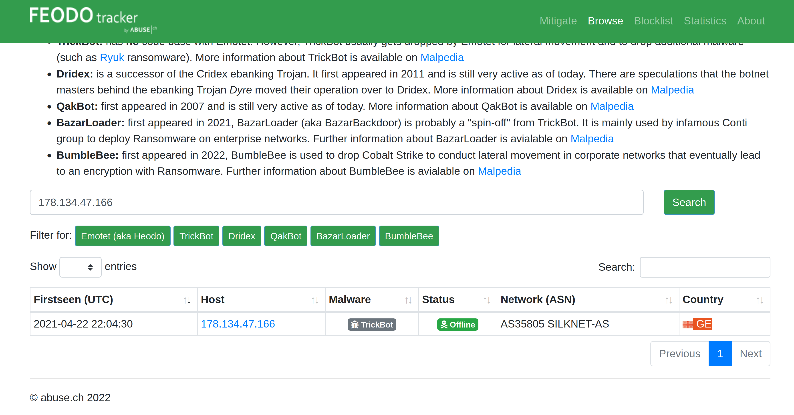
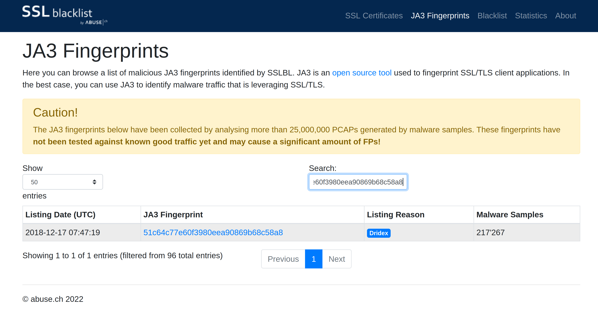
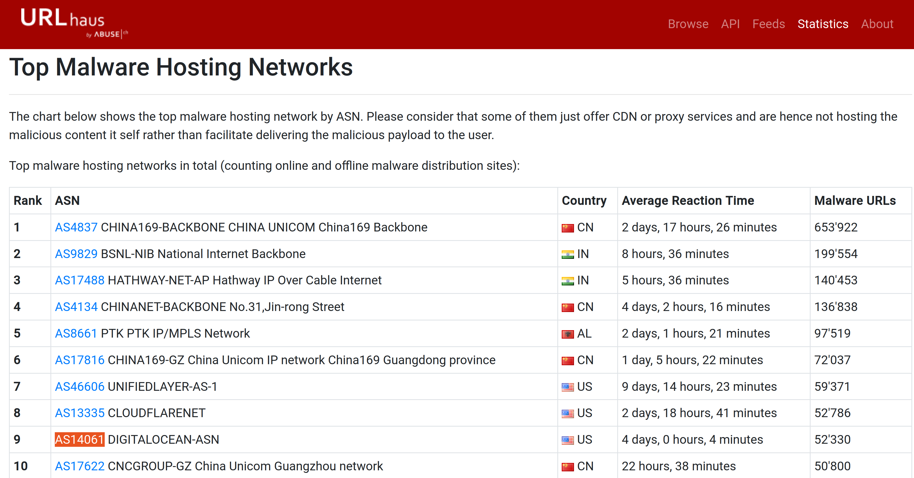
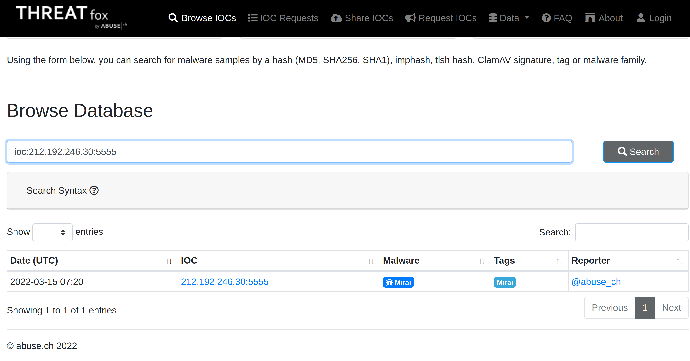

# Abuse.ch

Abuse.ch is a research project hosted by the Institute for Cybersecurity and Engineering at the Bern University of 
Applied Sciences in Switzerland. It was developed to identify and track malware and botnets through several 
operational platforms developed under the project. These platforms are:

* [Malware Bazaar](https://bazaar.abuse.ch/) A resource for sharing malware samples.
* [Feodo Tracker](https://feodotracker.abuse.ch/) A resource used to track botnet command and control (C2) infrastructure linked with Emotet, Dridex and TrickBot.
* [SSLBlacklist](https://sslbl.abuse.ch/) A resource for collecting and providing a blocklist for malicious SSL certificates and JA3/JA3s fingerprints.
* [URLHaus](https://urlhaus.abuse.ch/) A resource for sharing malware distribution sites.
* [ThreatFox](https://threatfox.abuse.ch/) A resource for sharing indicators of compromise (IOCs).

## MalwareBazaar

As the name suggests, this project is an all-in-one malware collection and analysis database. The project supports the following features:

* Malware Samples Upload: Security analysts can upload their malware samples for analysis and build the intelligence database. This can be done through the browser or an API.
* Malware Hunting: Hunting for malware samples is possible through setting up alerts to match various elements such as tags, signatures, YARA rules, ClamAV signatures and vendor detection.

## FeodoTracker

With this project, Abuse.ch is targeting to share intelligence on botnet Command & Control (C&C) servers associated 
with Dridex, Emotes (aka Heodo), TrickBot, QakBot and BazarLoader/BazarBackdoor. This is achieved by providing a 
database of the C&C servers that security analysts can search through and investigate any suspicious IP addresses 
they have come across. Additionally, they provide various IP and IOC blocklists and mitigation information to be 
used to prevent botnet infections.

| 
|:--:|
| Georgia is the country associated with botnet IP address 178.134.47.166. |

## SSL Blacklist

Abuse.ch developed this tool to identify and detect malicious SSL connections. From these connections, SSL 
certificates used by botnet C2 servers would be identified and updated on a denylist that is provided for use. The 
denylist is also used to identify JA3 fingerprints that would help detect and block malware botnet C2 communications 
on the TCP layer.

You can browse through the SSL certificates and JA3 fingerprints lists or download them to add to your deny list 
or threat hunting rulesets.

| 
|:--:|
| Dridex is associated with the JA3 Fingerprint 51c64c77e60f3980eea90869b68c58a8 on SSL Blacklist. |

## URLHaus

As the name points out, this tool focuses on sharing malicious URLs used for malware distribution. As an analyst, 
you can search through the database for domains, URLs, hashes and filetypes that are suspected to be malicious and 
validate your investigations.

The tool also provides feeds associated with country, AS number and Top Level Domain that an analyst can generate 
based on specific search needs.

| 
|:--:|
| DIGITALOCEAN-ASN has the ASN number AS14061. |

## ThreatFox

With ThreatFox, security analysts can search for, share and export indicators of compromise associated with malware. 
IOCs can be exported in various formats such as MISP events, Suricata IDS Ruleset, Domain Host files, DNS Response 
Policy Zone, JSON files and CSV files.

| 
|:--:|
| The IOC 212.192.246.30:5555 is linked to Mirai (alias Katana). |