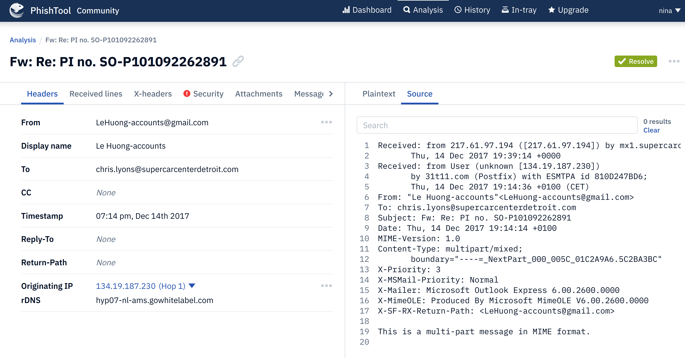
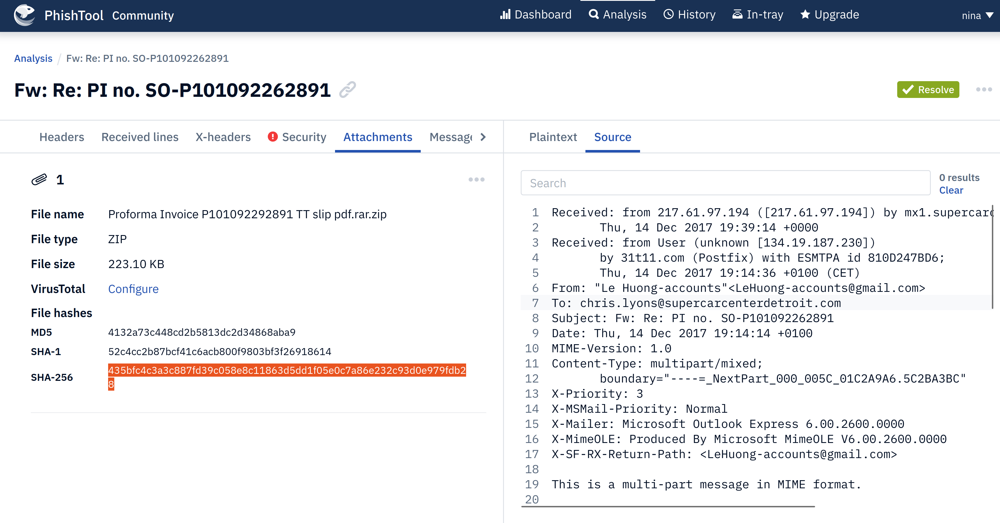
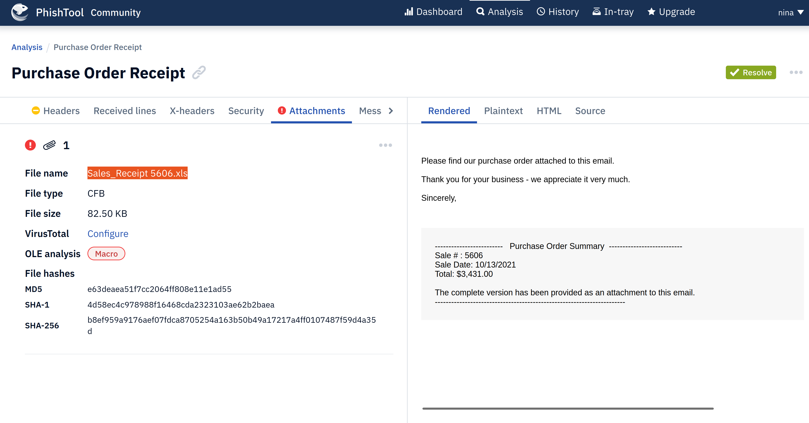

# PhishTool

Email phishing is one of the main precursors of any attack. Unsuspecting users get duped into the opening and 
accessing malicious files and links sent to them by email, as they appear to be legitimate. As a result, adversaries 
infect their victims’ systems with malware, harvesting their credentials and personal data and performing other 
actions such as financial fraud or conducting ransomware attacks.

PhishTool seeks to elevate the perception of phishing as a severe form of attack and provide a responsive means of 
email security. Through email analysis, security analysts can uncover email IOCs, prevent breaches and provide 
forensic reports that could be used in phishing containment and training engagements.

[Sign up for the Community version ->](https://app.phishtool.com/sign-up/community)

## Core features

* Perform email analysis: PhishTool retrieves metadata from phishing emails and provides analysts with the relevant 
explanations and capabilities to follow the email’s actions, attachments, and URLs to triage the situation.
* Heuristic intelligence: OSINT is baked into the tool to provide analysts with the intelligence needed to stay 
ahead of persistent attacks and understand what TTPs were used to evade security controls and allow the adversary 
to social engineer a target.
* Classification and reporting: Phishing email classifications are conducted to allow analysts to take action quickly. 
Additionally, reports can be generated to provide a forensic record that can be shared.

## Scenario 1

Download the task files for analysis, and upload to phishtool:

| 
|:--:|
| The recipient's email address of Email2.eml. |

Check the attachments tab:

| 
|:--:|
| Copy the attachment SHA256 hash (enter in [Talos](talos.md)). |

## Scenario 2

Download the task files for analysis, and upload to phishtool:

| 
|:--:|
| Get name of attachment and copy the SHA256 hash (enter in [Talos](talos.md)). |

