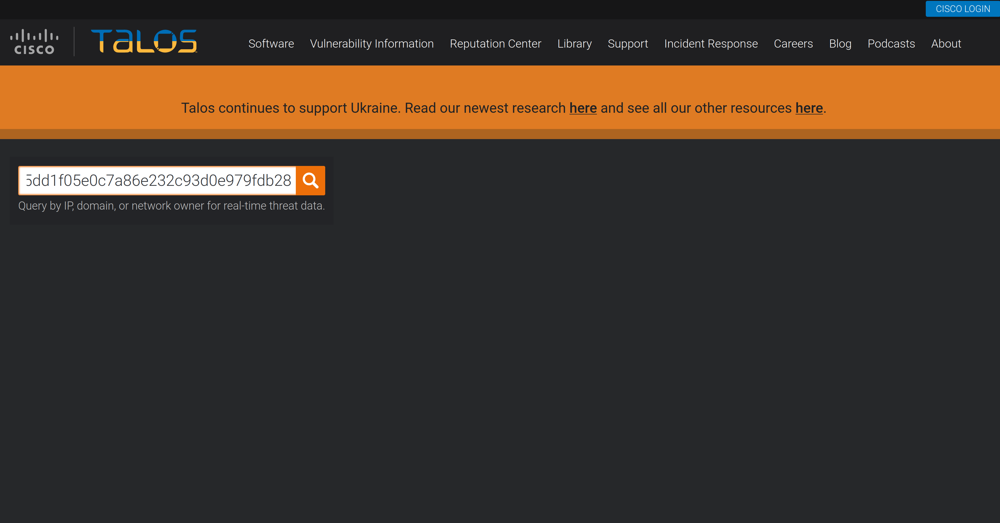
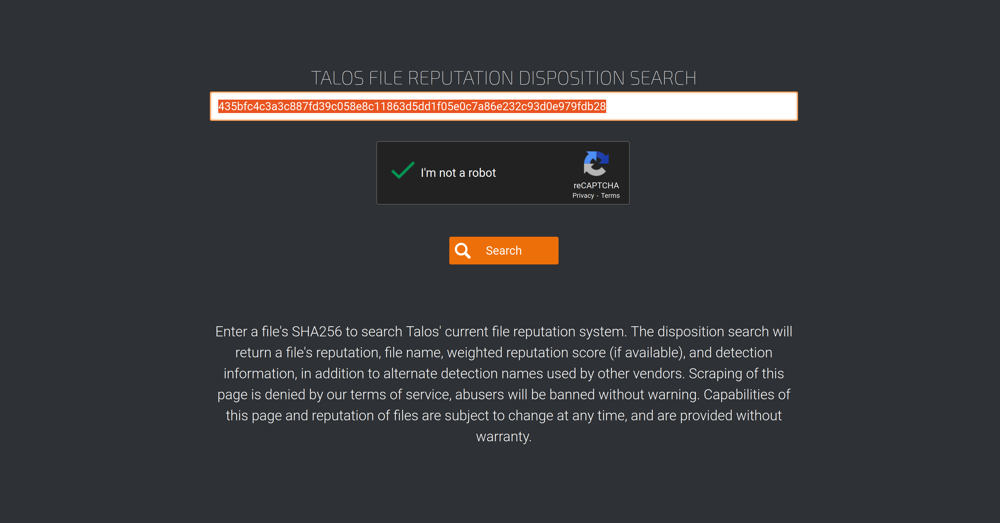
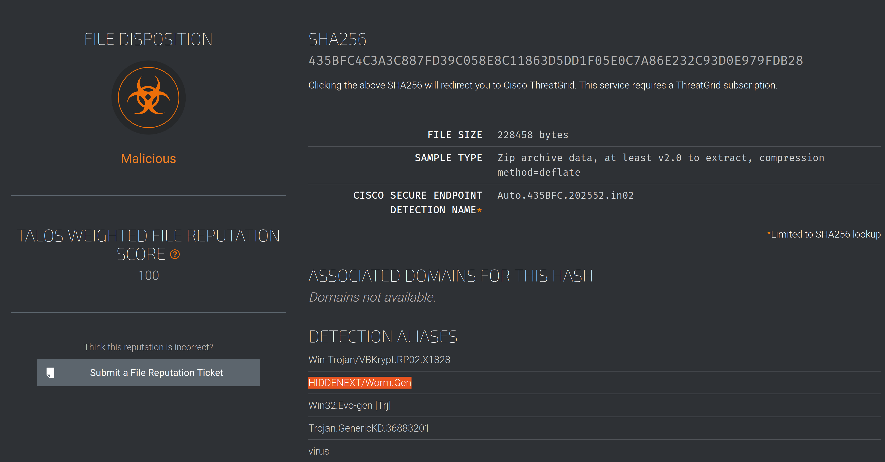
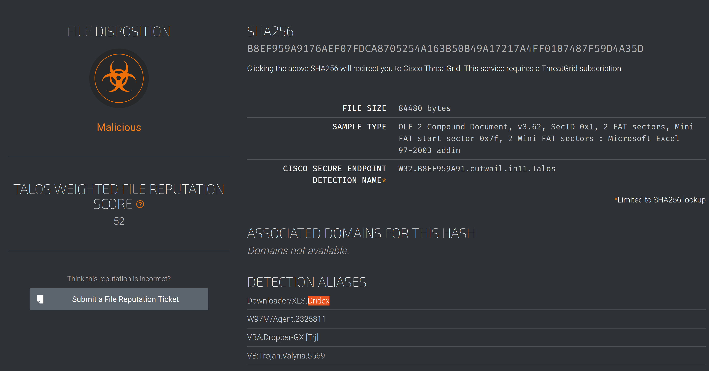

# Cisco Talos Intelligence

IT and Cybersecurity companies collect massive amounts of information that could be used for threat analysis and 
intelligence. Being one of those companies, Cisco assembled a large team of security practitioners called Cisco 
Talos to provide actionable intelligence, visibility on indicators, and protection against emerging threats through 
data collected from their products. The solution is accessible as [Talos Intelligence](https://talosintelligence.com/).

Cisco Talos encompasses six key teams:

* Threat Intelligence & Interdiction: Quick correlation and tracking of threats provide a means to turn simple IOCs into context-rich intel.
* Detection Research: Vulnerability and malware analysis is performed to create rules and content for threat detection.
* Engineering & Development: Provides the maintenance support for the inspection engines and keeps them up-to-date to identify and triage emerging threats.
* Vulnerability Research & Discovery: Working with service and software vendors to develop repeatable means of identifying and reporting security vulnerabilities.
* Communities: Maintains the image of the team and the open-source solutions.
* Global Outreach: Disseminates intelligence to customers and the security community through publications.

More information about Cisco Talos can be found on their 
[White Paper (pdf)](https://www.talosintelligence.com/docs/Talos_WhitePaper.pdf).

## Scenario 1

| 
|:--:|
| Enter the attachment SHA256 hash found with [phishtool](phishtool.md) of Email2.eml. |

| 
|:--:|
| A bit of song and dance. |

| 
|:--:|
| And results. |

## Scenario 2

| 
|:--:|
| And results. |