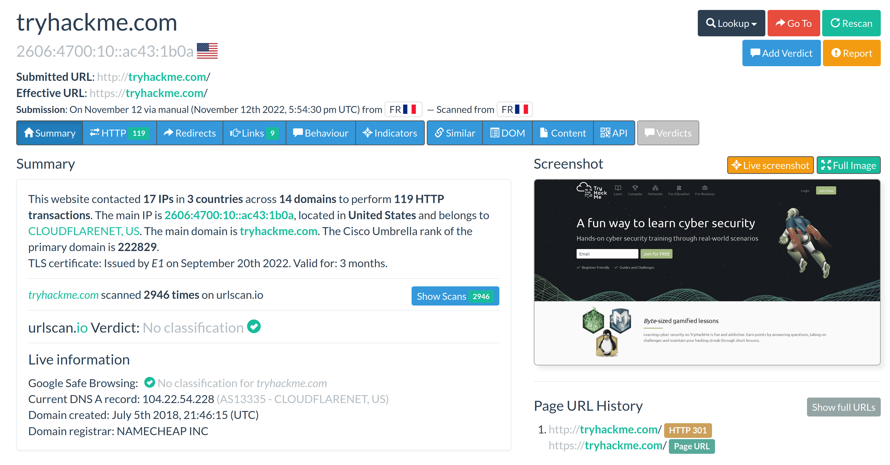

# UrlScan.io

[Urlscan.io](https://urlscan.io) is a free service developed to assist in scanning and analysing websites. It is used 
to automate the process of browsing and crawling through websites to record activities and interactions.

When a URL is submitted, the information recorded includes the domains and IP addresses contacted, resources 
requested from the domains, a snapshot of the web page, technologies used and other metadata about the website.

The site provides two views, the first one showing the most recent scans performed and the second one showing 
current live scans.

| 
|:--:|
| Summary page and tabs with more interesting information. |

* The Cisco Umbrella rank of the primary domain is (at the time of writing) _222829_. 
* This website contacted 17 IPs in 3 countries across _14 domains_ to perform 119 HTTP transactions.
* Domain registrar: _NAMECHEAP INC_
* The main IP is _2606:4700:10::ac43:1b0a_ (IPv6)
