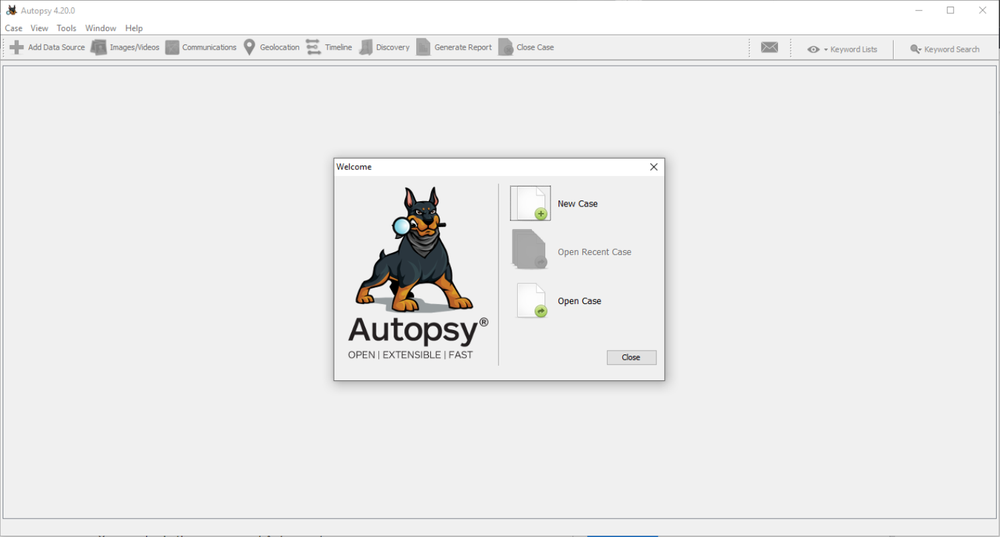
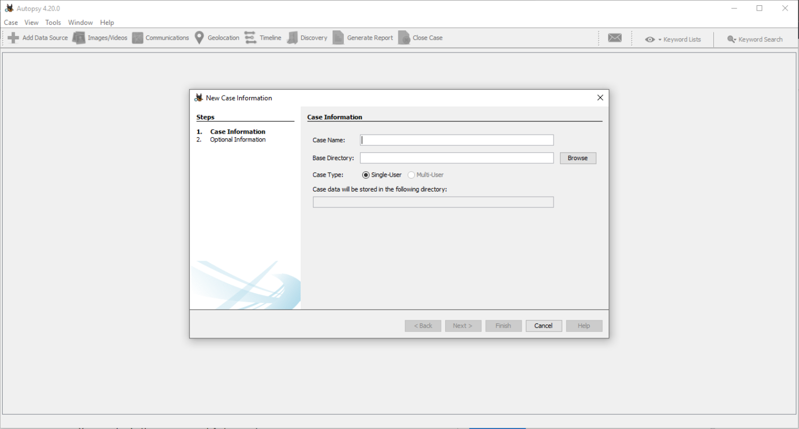

# Autopsy on Windows

Much easier, spin up a windows VM, and [install autopsy](https://www.autopsy.com/). Works out of the box.

## Usage

Before [diving into Autopsy and analysing data](https://dfir.tymyrddin.dev/docs/cd/sysinternals), some steps are to be taken; such as identifying the data source and what Autopsy actions to do with the data source. 

Basic workflow:

* Create/open a case for the data source to investigate
* Select the data source to analyse
* Configure the ingest modules to extract specific artefacts from the data source
* Review the artefacts extracted by the ingest modules
* Create the report

### New Case

To prepare a new case investigation, you need to create a case file from the data source. When you start Autopsy, there will be three options. You can create a new case file using the "New Case" option. Once you click on the "New Case" option, the Case Information menu opens, where information about the case is populated.

* Case Name: The name you wish to give to the case
* Base Directory: The root directory that will store all the files specific to the case (the full path will be displayed)
* Case Type: Specify whether this case will be local (Single-user) or hosted on a server where multiple analysts can review (Multi-user)

DFIRScience offers two YouTube mini courses to quickly get started, respecting [common DFIR practices](https://dfir.tymyrddin.dev/docs/notes/readme):

* [Starting a New Digital Forensic Investigation Case in Autopsy 4.19+](https://www.youtube.com/watch?v=fEqx0MeCCHg)
* [Data Artifacts, Analysis Results and Reporting in Autopsy 4.19+](https://www.youtube.com/watch?v=5SHB4HwkX28)