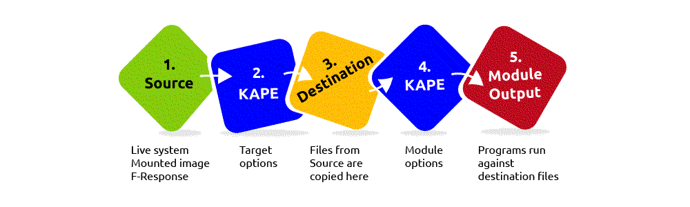

# Kroll Artifact Parser and Extractor (KAPE)

Kroll Artifact Parser and Extractor (KAPE) parses and extracts Windows forensics artifacts. It is a tool that can significantly reduce the time needed to respond to an incident by providing forensic artifacts from a live system or a storage device much earlier than the imaging process completes.

KAPE serves two primary purposes, 1) collect files and 2) process the collected files as per the provided options. For achieving these purposes, KAPE uses the concept of targets and modules. Targets can be defined as the forensic artifacts that need to be collected. Modules are programs that process the collected artifacts and extract information from them.

| 
|:--:|
| KAPE can extract targets from a Live system, a mounted image, or the F-response utility. |

## Target options

In KAPE's lexicon, "Targets" (`.tkape`) are the artifacts that need to be collected from a system or image and copied to our provided destination. For example, Windows `Prefetch` is a forensic artifact for evidence of execution so that we can create a Target for it. Similarly, we can also create targets for the registry hives. In short, targets copy files from one place to another.

KAPE also supports Compound Targets. KAPE is often used for quick triage collection and analysis. The purpose of KAPE will not be fulfilled if we have to collect each artifact individually. Compound Targets help collect multiple targets by giving a single command. Examples of Compound Targets include `!BasicCollection`, `!SANS_triage` and `KAPEtriage`. The Compound Targets are on the path `KAPE\Targets\Compound`. 

The `!Disabled` directory contains KAPE targets that you want to keep in the KAPE instance, but you do not want them to appear in the active Targets list.

The `!Local` contains targets that you do not want to sync with the KAPE GitHub repository. These can be Targets that are specific to an environment. Similarly, anything not present in the GitHub repository when updating KAPE will be moved to the `!Local` directory.

## Module options

Modules (`.mkape`), in KAPE's lexicon, run specific tools against the provided set of files. Their goal is not to copy files from one place to another but rather run some command and store the output. Generally, the output is in the form of `.csv` or `.txt` files.

Most of the Modules are grouped together in different directories.

The `bin` directory contains executables that we want to run on the system but are not natively present on most systems. KAPE will run executables either from the bin directory or the complete path. An example of files to be kept in the bin directory are Eric Zimmerman's tools, which are generally not present on a Windows system.

