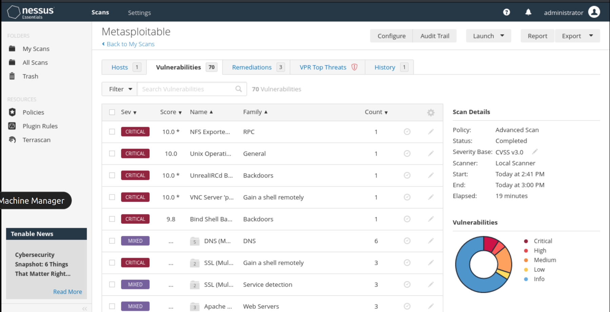
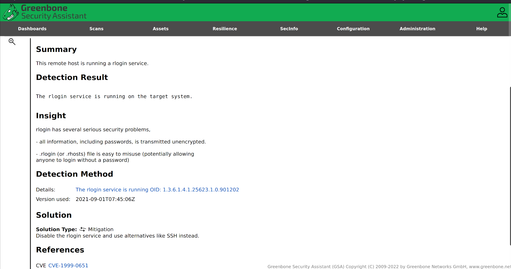

# Automated vulnerability scanning

## Nessus

[Nessus](https://www.tenable.com/products/nessus) is a vulnerability scanner useful for network discovery using port scans and enumerate services from either an authenticated or nonauthenticated context. It then compares that information to an extensive internal database of known vulnerabilities to highlight potential or confirmed vulnerabilities on the identified services.

It was created by Renaud Daraison in 1998 and was originally an open-source remote security scanner. Several years later in 2005, Tenable Network Security changed Nessus over to a closed-source license.

## Greenbone (OpenVAS)

[OpenVAS](https://www.openvas.org/) is an open-source vulnerability scanner that started as a spin-off of Nessus called GNessUs. It took until 2006 for GNessUs to transform into the OpenVAS tool. In 2017, Greenbone changed the OpenVAS framework to Greenbone Vulnerability Management, and change the OpenVAS Scanner into a module.

## Nikto

[Nikto](https://cirt.net/Nikto2) is an incredibly aggressive and noisy web server vulnerability scanner, and included in Kali.

    nikto -h [IP address] -p 80 -o nikto_scan -F txt

## Resources

* [Nessus Essentials](https://www.tenable.com/products/nessus/nessus-essentials)
* [Greenbone](https://greenbone.github.io/docs/latest/index.html)
* [Greenbone getting started tutorials](https://www.greenbone.net/en/selflearning-courses/)
* [Nikto wiki](https://github.com/sullo/nikto/wiki)
