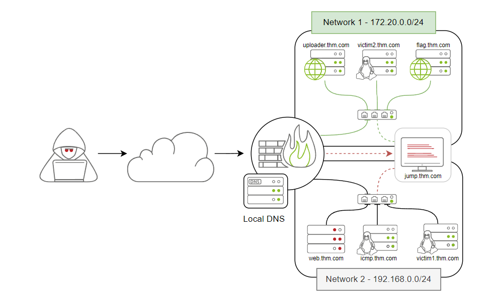

# TryHackMe nodes

|  |
|:--:|
| [TryHackMe Data exfiltration room](https://tryhackme.com/room/dataxexfilt) |

Domain names and network access:

| Domain Name      | IP Address      | Network Access  | 
|:-----------------|:----------------|:----------------|
| jump.thm.com     | `192.168.0.133` | Net 1 and Net 2 | 
| uploader.thm.com | `172.20.0.100`  | Net 1           | 
| flag.thm.com     | `***.**.*.***`  | Net 1           | 
| victim2.thm.com  | `172.20.0.101`  | Net 1           | 
| web.thm.com      | `192.168.0.100` | Net 2           | 
| icmp.thm.com     | `192.168.0.121` | Net 2           | 
| victim1.thm.com  | `192.168.0.101` | Net 2           |