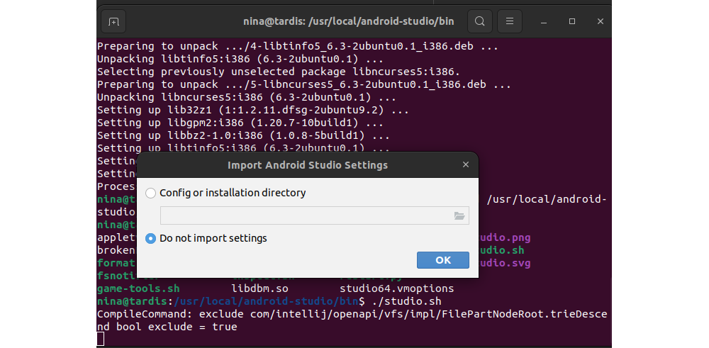
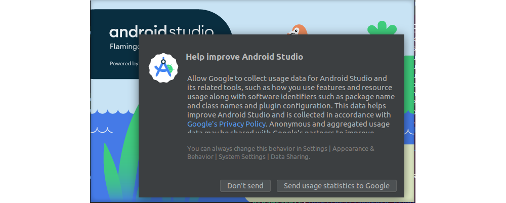
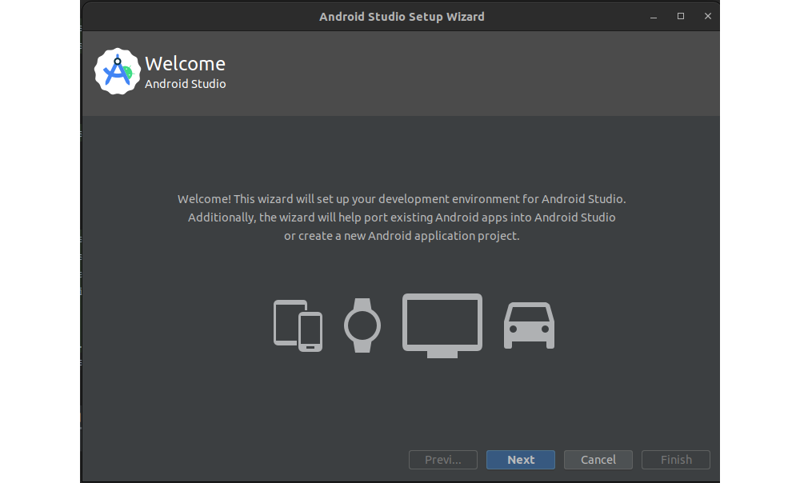
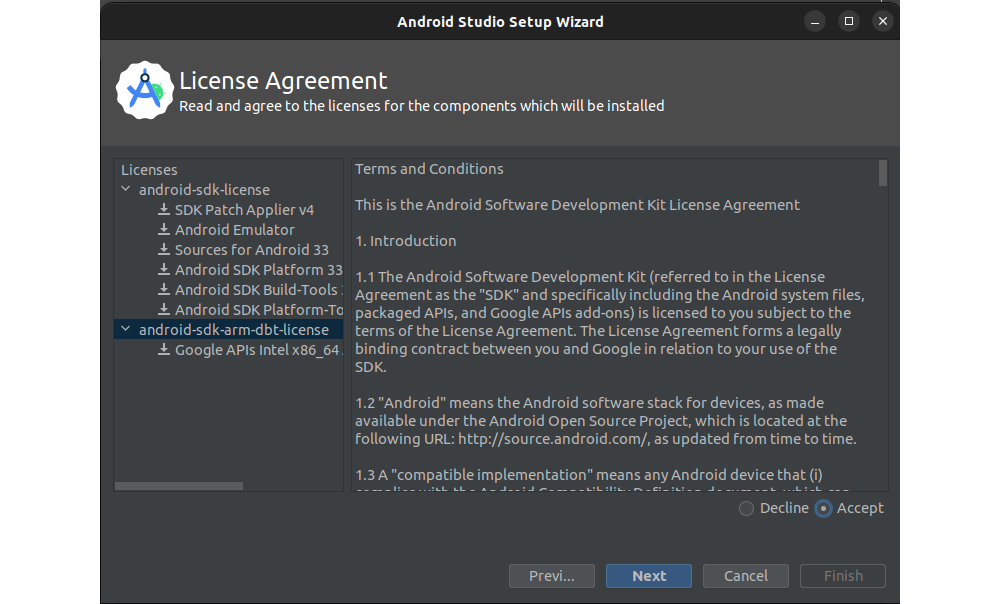
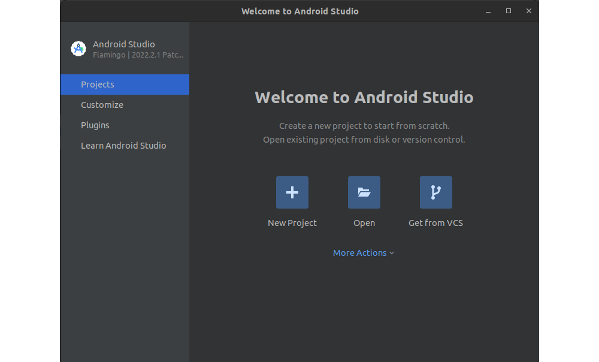

# Android Studio

A working installation of the Android SDK is a must during the investigation of a forensic device. Android Studio is the official Integrated Development Environment (IDE) for Android app development, and includes the SDK. It comes with tools such as Build Tools, Platform Tools, Emulator, Jetifier, and command line tools. 

Once the Android SDK is installed along with the release platform, you can create an Android Virtual Device (or AVD, also called an emulator), which is often used by developers when creating new applications. Emulators are also useful when trying to understand how applications behave and execute on a device. This could be helpful in confirming certain findings that are unearthed during a forensic investigation.

## Installation

1. [Download studio](https://developer.android.com/studio/index.html) and unpack.
2. Move `android-studio` to `/usr/local/`:

```text
nina@tardis:~/Downloads/android-studio-2022.2.1.20-linux$ sudo mv android-studio /usr/local/
[sudo] password for nina:
``` 
3. Install dependencies:

```text
nina@tardis:~/Downloads/android-studio-2022.2.1.20-linux$ sudo apt-get install libc6:i386 libncurses5:i386 libstdc++6:i386 lib32z1 libbz2-1.0:i386
```

4. Run the script:

```text
nina@tardis:~/Downloads/android-studio-2022.2.1.20-linux$ cd /usr/local/android-studio/bin
nina@tardis:/usr/local/android-studio/bin$ ls
appletviewer.policy  helpers          lldb                studio.png
brokenPlugins.db     icons            ltedit.sh           studio.sh
format.sh            idea.properties  profiler.sh         studio.svg
fsnotifier           inspect.sh       restart.py
game-tools.sh        libdbm.so        studio64.vmoptions
nina@tardis:/usr/local/android-studio/bin$ ./studio.sh
```





5. The script will start the jetbrains wizard. Follow the steps.



6. When asked for accepting license, you have to accept ***both***:



7. After downloading the components, the wizards starts up Android Studio:


