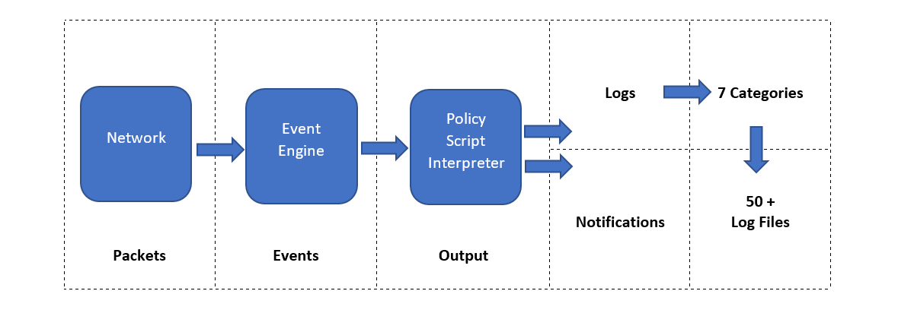

# Zeek

Zeek (formerly Bro) is an open-source and commercial passive Network Monitoring tool (traffic analysis framework) 
developed by Lawrence Berkeley Labs. Today, Zeek is supported by several developers, and Corelight provides an 
Enterprise-ready fork of Zeek. Therefor this tool is called both open source and commercial. The differences between 
the open-source version and the commercial version are detailed [here](https://corelight.com/products/compare-to-open-source-zeek?hsLang=en).

Zeek differs from known monitoring and IDS/IPS tools by providing a wide range of detailed logs ready to investigate 
both for forensics and data analysis actions. Currently, Zeek provides 50+ logs in 7 categories.

## Differences between Snort and Zeek

While both are called IDS/NIDS, it is good to know the cons and pros of each tool and use them in a specific manner. 
There are some overlapping functionalities, but they are different in purpose.

| **Tool**                 | **Zeek**                                                                                                                                                                                        | **Snort**                                                                                                                                                             |
|:-------------------------|-------------------------------------------------------------------------------------------------------------------------------------------------------------------------------------------------|-----------------------------------------------------------------------------------------------------------------------------------------------------------------------|
| **Capabilities**         | NSM and IDS framework.  Heavily focused on network analysis,  on specific threats to trigger alerts,  and the detection mechanism is   focused on events.                           | An IDS/IPS system.  Heavily focused on signatures to  detect vulnerabilities, and the  detection mechanism is focused on  signature patterns and packets. |
| **Pros**                 | Hard to use.  The analysis is done out of the Zeek,  manually or by automation.                                                                                                           | Hard to detect complex threats.                                                                                                                                       |
| **Cons**                 | Provides in-depth traffic visibility.  Useful for threat hunting.  Ability to detect complex threats.  Has a scripting language  Supports event correlation.  Easy to read logs. | Easy to write rules.  Cisco supported rules.  Community support.                                                                                                |
| **Common  use cases** | Network monitoring.  In-depth traffic investigation.  Intrusion detecting in chained events.                                                                                              | Intrusion detection and prevention.  Stop known attacks/threats.                                                                                                   |

## Zeek architecture

| 
|:--:|
| Zeek has two primary layers: an `Event Engine` and a `Policy Script Interpreter`.  |

The Event Engine layer is where the packets are processed; it is called the event core and is responsible for 
describing the event without focusing on event details. It is where the packages are divided into parts such as source 
and destination addresses, protocol identification, session analysis and file extraction. The Policy Script Interpreter 
layer is where the semantic analysis is conducted. It is responsible for describing the event correlations by using 
Zeek scripts.

## Zeek frameworks

Zeek has several frameworks to provide extended functionality in the scripting layer. These frameworks enhance Zeek's 
flexibility and compatibility with other network components. Each framework focuses on the specific use case and easily 
runs with Zeek installation. For instance, we will be using the "Logging Framework" for all cases. Having ide on each 
framework's functionality can help users quickly identify an event of interest. More on its frameworks 
[here](https://docs.zeek.org/en/master/frameworks/index.html).
