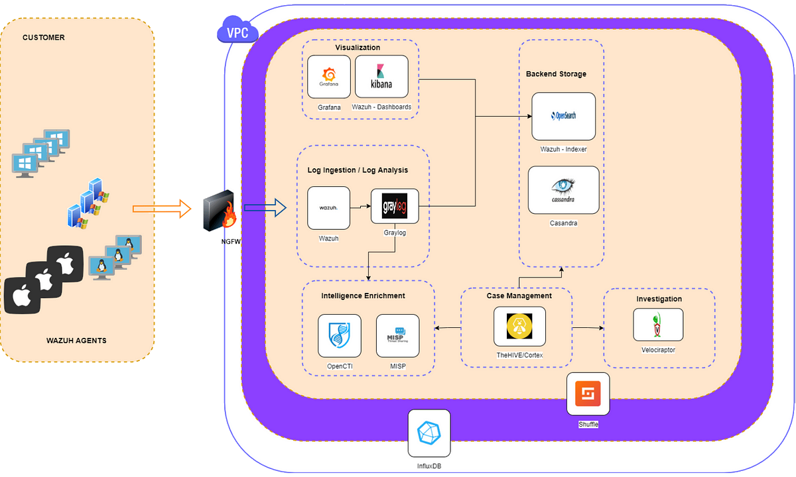

# Introduction

[Key elements for a SIEM stack](https://www.youtube.com/playlist?list=PLB6hQ_WpB6U0WeroZAfssgRpxW8olnkqy): Watching this playlist is highly informative.

Most of these tools are Open Source, free, and together meet the requirements of [the SIEM stack](https://siem.tymyrddin.dev/docs/notes/siem#siem-stack-requirements):

* [Wazuh](wazuh.md)
* [Graylog](graylog.md)
* [Grafana](grafana.md)
* [OpenCTI](opencti.md)
* [MISP](misp.md)
* [Praeco](praeco.md)
* [TheHive](thehive.md)
* [Cortex](cortex.md)
* [Velociraptor](velociraptor.md)
* [Shuffle](shuffle.md)
* [InfluxDB](influxdb.md)

----

* [ELK stack](elk-stack.md)
* [Splunk](splunk.md)
