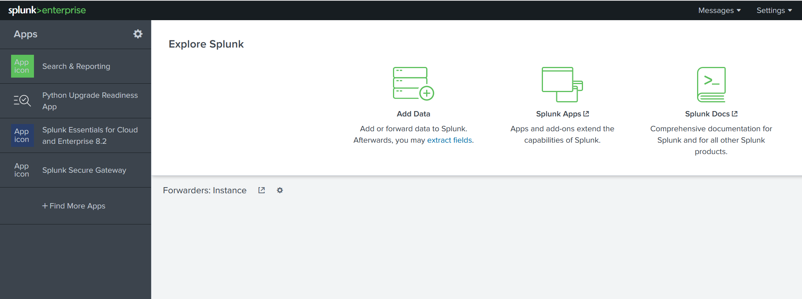

# Splunk

[Splunk](https://www.splunk.com/) is a SIEM solutions used to collect, analyse and correlate the network and machine logs in real-time.

## Components

### Splunk forwarder

Splunk forwarder is a lightweight agent installed on the endpoint intended to be monitored, and its main task is to collect the data and send it to the Splunk instance. It does not affect the endpoint's performance as it takes very few resources to process. Some key data sources are:

* Web server generating web traffic.
* Windows machine generating Windows Event Logs, PowerShell, and Sysmon data.
* Linux host generating host-centric logs.
* Database generating DB connection requests, responses, and errors.

### Splunk indexer

Splunk indexer plays the main role in processing the data it receives from forwarders. It takes the data, normalises it into field-value pairs, determines the datatype of the data, and stores them as events. Processed data is easy to search and analyse.

### Search head

Splunk search head is the place within the Search & Reporting App where users can search the indexed logs. 
When the user searches for a term or uses a Search language known as Splunk Search Processing Language, the request is sent to the indexer and the relevant events are returned in the form of field-value pairs.

Search head also provides the ability to transform the results into presentable tables, visualizations like pie-chart, bar-chart and column-chart.

## Navigation

### Splunk Bar

When you access Splunk, you will see the default home screen:

In the Splunk Bar, you can see system-level messages (Messages), configure the Splunk instance (Settings), review the progress of jobs (Activity), miscellaneous information such as tutorials (Help), and a search feature (Find).  

### Apps Panel

In this panel, you can see the apps installed for the Splunk instance. The default app for every Splunk installation is **Search & Reporting**. 

### Explore Splunk

The next section is **Explore Splunk**. This panel contains quick links to add data to the Splunk instance, add new Splunk apps, and access the Splunk documentation. 

### Splunk Dashboard

The last section is the **Home Dashboard**. By default, no dashboards are displayed. You can choose from a range of dashboards readily available within your Splunk instance. You can select a dashboard from the dropdown menu or by visiting the dashboards listing page.

You can also create dashboards and add them to the Home Dashboard. The dashboards you create can be viewed isolated from the other dashboards by clicking on the `Yours` tab.

## Adding data

Splunk can ingest any data. As per the Splunk documentation, when data is added to Splunk, the data is processed and transformed into a series of individual events. 

The data sources can be event logs, website logs, firewall logs, etc. Data sources are grouped into categories. 