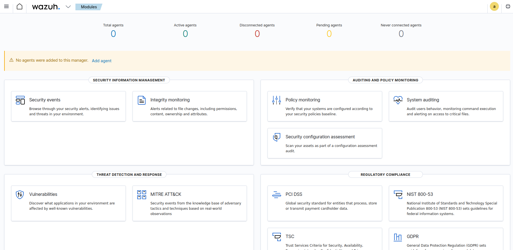

# Wazuh multi-node deployment with docker

Multi-node Wazuh SIEM stack in a Qemu/KVM local VM, with let's encrypt certificates and agent enrollment. The nodes are two Wazuh manager nodes (one master and one worker), three Wazuh indexer nodes, and a Wazuh dashboard node.

## VM

A local QEMU/KVM guest, with 8GB RAM, 4 cores, 100 GB memory and Ubuntu Server 22.04.3 without any additional packages. 

I had a problem getting SSH to work because I have a fairly complicated SSH setup with a number of private keys in my `.ssh` directory. The solution was to disable Public Key Authentication at the command line using the `-o` optional argument:

```text
nina@tardis:~/.ssh$ ssh -i id_rsa nina@192.168.122.XXX
Received disconnect from 192.168.122.196 port 22:2: Too many authentication failures
Disconnected from 192.168.122.196 port 22
nina@tardis:~/.ssh$ ssh -o PubkeyAuthentication=no nina@192.168.122.196
nina@192.168.122.196's password: 
Welcome to Ubuntu 22.04.3 LTS (GNU/Linux 5.15.0-83-generic x86_64)

 * Documentation:  https://help.ubuntu.com
 * Management:     https://landscape.canonical.com
 * Support:        https://ubuntu.com/advantage

  System information as of Sun 10 Sep 20:07:09 UTC 2023

  System load:  0.0                Processes:               128
  Usage of /:   14.3% of 47.93GB   Users logged in:         1
  Memory usage: 3%                 IPv4 address for enp1s0: 192.168.122.196
  Swap usage:   0%


Expanded Security Maintenance for Applications is not enabled.

0 updates can be applied immediately.

Enable ESM Apps to receive additional future security updates.
See https://ubuntu.com/esm or run: sudo pro status


Last login: Sun Sep 10 19:35:33 2023
```

## Docker

Using the Docker install script to install Docker (alternatively, install it manually, it is available for all platforms):

```text
nina@wazuh:~$ curl -sSL https://get.docker.com/ | sh
# Executing docker install script, commit: c2de0811708b6d9015ed1a2c80f02c9b70c8ce7b
+ sudo -E sh -c apt-get update -qq >/dev/null
[sudo] password for nina: 
+ sudo -E sh -c DEBIAN_FRONTEND=noninteractive apt-get install -y -qq apt-transport-https ca-certificates curl >/dev/null
+ sudo -E sh -c install -m 0755 -d /etc/apt/keyrings
+ sudo -E sh -c curl -fsSL "https://download.docker.com/linux/ubuntu/gpg" | gpg --dearmor --yes -o /etc/apt/keyrings/docker.gpg
+ sudo -E sh -c chmod a+r /etc/apt/keyrings/docker.gpg
+ sudo -E sh -c echo "deb [arch=amd64 signed-by=/etc/apt/keyrings/docker.gpg] https://download.docker.com/linux/ubuntu jammy stable" > /etc/apt/sources.list.d/docker.list
+ sudo -E sh -c apt-get update -qq >/dev/null
+ sudo -E sh -c DEBIAN_FRONTEND=noninteractive apt-get install -y -qq docker-ce docker-ce-cli containerd.io docker-compose-plugin docker-ce-rootless-extras docker-buildx-plugin >/dev/null
+ sudo -E sh -c docker version
Client: Docker Engine - Community
 Version:           24.0.6
 API version:       1.43
 Go version:        go1.20.7
 Git commit:        ed223bc
 Built:             Mon Sep  4 12:31:44 2023
 OS/Arch:           linux/amd64
 Context:           default

Server: Docker Engine - Community
 Engine:
  Version:          24.0.6
  API version:      1.43 (minimum version 1.12)
  Go version:       go1.20.7
  Git commit:       1a79695
  Built:            Mon Sep  4 12:31:44 2023
  OS/Arch:          linux/amd64
  Experimental:     false
 containerd:
  Version:          1.6.22
  GitCommit:        8165feabfdfe38c65b599c4993d227328c231fca
 runc:
  Version:          1.1.8
  GitCommit:        v1.1.8-0-g82f18fe
 docker-init:
  Version:          0.19.0
  GitCommit:        de40ad0

================================================================================

To run Docker as a non-privileged user, consider setting up the
Docker daemon in rootless mode for your user:

    dockerd-rootless-setuptool.sh install

Visit https://docs.docker.com/go/rootless/ to learn about rootless mode.


To run the Docker daemon as a fully privileged service, but granting non-root
users access, refer to https://docs.docker.com/go/daemon-access/

WARNING: Access to the remote API on a privileged Docker daemon is equivalent
         to root access on the host. Refer to the 'Docker daemon attack surface'
         documentation for details: https://docs.docker.com/go/attack-surface/

================================================================================

nina@wazuh:~$ 
```

Starting Docker and enabling the service to run at boot time:

```text
nina@wazuh:~$ systemctl start docker
==== AUTHENTICATING FOR org.freedesktop.systemd1.manage-units ===
Authentication is required to start 'docker.service'.
Authenticating as: nina
Password: 
==== AUTHENTICATION COMPLETE ===
nina@wazuh:~$ systemctl status docker
● docker.service - Docker Application Container Engine
     Loaded: loaded (/lib/systemd/system/docker.service; enabled; vendor preset: en>
     Active: active (running) since Sun 2023-09-10 20:17:25 UTC; 2min 31s ago
TriggeredBy: ● docker.socket
       Docs: https://docs.docker.com
   Main PID: 14671 (dockerd)
      Tasks: 8
     Memory: 24.4M
        CPU: 257ms
     CGroup: /system.slice/docker.service
             └─14671 /usr/bin/dockerd -H fd:// --containerd=/run/containerd/contain>

Sep 10 20:17:24 wazuh systemd[1]: Starting Docker Application Container Engine...
Sep 10 20:17:24 wazuh dockerd[14671]: time="2023-09-10T20:17:24.914379249Z" level=i>
Sep 10 20:17:24 wazuh dockerd[14671]: time="2023-09-10T20:17:24.915954899Z" level=i>
Sep 10 20:17:25 wazuh dockerd[14671]: time="2023-09-10T20:17:25.027330263Z" level=i>
Sep 10 20:17:25 wazuh dockerd[14671]: time="2023-09-10T20:17:25.233982886Z" level=i>
Sep 10 20:17:25 wazuh dockerd[14671]: time="2023-09-10T20:17:25.263774303Z" level=i>
Sep 10 20:17:25 wazuh dockerd[14671]: time="2023-09-10T20:17:25.263893989Z" level=i>
Sep 10 20:17:25 wazuh dockerd[14671]: time="2023-09-10T20:17:25.320905195Z" level=i>
Sep 10 20:17:25 wazuh systemd[1]: Started Docker Application Container Engine.
nina@wazuh:~$ systemctl enable docker
Synchronizing state of docker.service with SysV service script with /lib/systemd/systemd-sysv-install.
Executing: /lib/systemd/systemd-sysv-install enable docker
==== AUTHENTICATING FOR org.freedesktop.systemd1.reload-daemon ===
Authentication is required to reload the systemd state.
Authenticating as: nina
Password: 
==== AUTHENTICATION COMPLETE ===
```

## Docker Compose

```text
nina@wazuh:~$ sudo curl -L "https://github.com/docker/compose/releases/download/2.21.0/docker-compose-$(uname -s)-$(uname -m)" -o /usr/local/bin/docker-compose
  % Total    % Received % Xferd  Average Speed   Time    Time     Time  Current
                                 Dload  Upload   Total   Spent    Left  Speed
100     9  100     9    0     0     22      0 --:--:-- --:--:-- --:--:--    22
```

Make executable, create a symlink and check it works:

```text
nina@wazuh:~$ sudo chmod +x /usr/local/bin/docker-compose
nina@wazuh:~$ sudo ln -s /usr/local/bin/docker-compose /usr/bin/docker-compose
nina@wazuh:~$ docker compose version
Docker Compose version v2.21.0
```

## Preparing the VM

Configuring the VM host preferences to give at least 6 GB of memory to the host that creates the containers (this does not necessarily mean that it is used, but Elasticsearch requires it to work):

```text
nina@wazuh:~$ sudo sysctl -w vm.max_map_count=262144
vm.max_map_count = 262144
```

To set this value permanently, update the `vm.max_map_count` setting in `/etc/sysctl.conf`. Scroll down to the bottom and add it:

```text
nina@wazuh:~$ sudo nano /etc/sysctl.conf
```

```text
...
###################################################################
# Magic system request Key
# 0=disable, 1=enable all, >1 bitmask of sysrq functions
# See https://www.kernel.org/doc/html/latest/admin-guide/sysrq.html
# for what other values do
#kernel.sysrq=438
vm.max_map_count=262144
```

## Cloning the Wazuh repo

For cloning the Wazuh Docker repo, the Wazuh team have provided YAML files and scripts that can be used to quickly deploy a SIEM stack ([choose release version](https://github.com/wazuh/wazuh-docker/releases)):

```text
nina@wazuh:~$ git clone https://github.com/wazuh/wazuh-docker.git -b v4.5.2 --depth=1
Cloning into 'wazuh-docker'...
remote: Enumerating objects: 100, done.
remote: Counting objects: 100% (100/100), done.
remote: Compressing objects: 100% (87/87), done.
remote: Total 100 (delta 17), reused 37 (delta 7), pack-reused 0
Receiving objects: 100% (100/100), 53.08 KiB | 235.00 KiB/s, done.
Resolving deltas: 100% (17/17), done.
Note: switching to '2902a0ce0b0b11c7f29570b0abbafa2d491fbb33'.

You are in 'detached HEAD' state. You can look around, make experimental
changes and commit them, and you can discard any commits you make in this
state without impacting any branches by switching back to a branch.

If you want to create a new branch to retain commits you create, you may
do so (now or later) by using -c with the switch command. Example:

  git switch -c <new-branch-name>

Or undo this operation with:

  git switch -

Turn off this advice by setting config variable advice.detachedHead to false
```

## Generate certs

Let’s Encrypt can’t provide certificates for “localhost” because nobody uniquely owns it, and it’s not rooted in a top level domain like “.com” or “.net”. It’s possible to set up your own domain name that happens to resolve to 127.0.0.1, and get a certificate for it using the DNS challenge. This is a bad idea. The best option is again to generate self-signed certs. But later, for on a server with a domain, this is the [Wazuh documentation for setting up Let's Encrypt certs](https://documentation.wazuh.com/current/user-manual/wazuh-dashboard/configuring-third-party-certs/ssl.html).

In the `wazuh-docker/single-node` directory:

```text
nina@wazuh:~/wazuh-docker/multi-node$ sudo docker compose -f generate-indexer-certs.yml run --rm generator
[+] Creating 1/0
 ✔ Network multi-node_default  Created                                         0.1s 
[+] Running 5/5
 ✔ generator 4 layers [⣿⣿⣿⣿]      0B/0B      Pulled                          140.4s 
   ✔ edaedc954fb5 Pull complete                                               88.8s 
   ✔ 573f4d11a520 Pull complete                                              136.7s 
   ✔ 8f200922197d Pull complete                                                0.9s 
   ✔ 55a86de68c5c Pull complete                                                2.5s 
The tool to create the certificates exists in the in Packages bucket
10/09/2023 20:44:21 INFO: Admin certificates created.
10/09/2023 20:44:21 INFO: Wazuh indexer certificates created.
10/09/2023 20:44:22 INFO: Wazuh server certificates created.
10/09/2023 20:44:22 INFO: Wazuh dashboard certificates created.
Moving created certificates to the destination directory
Changing certificate permissions
Setting UID indexer and dashboard
Setting UID for wazuh manager and worker
```

## Deployment

```text
sudo docker compose up
...
multi-node-wazuh3.indexer-1   | [2023-09-10T21:30:01,483][INFO ][o.o.a.u.d.DestinationMigrationCoordinator] [wazuh3.indexer] Detected cluster change event for destination migration
multi-node-wazuh3.indexer-1   | [2023-09-10T21:30:15,061][INFO ][o.o.j.s.JobSweeper       ] [wazuh3.indexer] Running full sweep
multi-node-wazuh2.indexer-1   | [2023-09-10T21:30:16,555][INFO ][o.o.j.s.JobSweeper       ] [wazuh2.indexer] Running full sweep
multi-node-wazuh1.indexer-1   | [2023-09-10T21:30:18,052][INFO ][o.o.j.s.JobSweeper       ] [wazuh1.indexer] Running full sweep
```

When the JobSweeper starts, which by default will keep going, pointing browser to the IP of the server VM gives:



## Agent enrollment

* Enrollment via agent configuration: Once the IP address of the manager has been set, the agent will be able to automatically request the key and import it. This is the recommended enrollment method.
* Enrollment via manager API: The user requests the key from the manager API and then manually imports it to the agent.

To be continued ...

