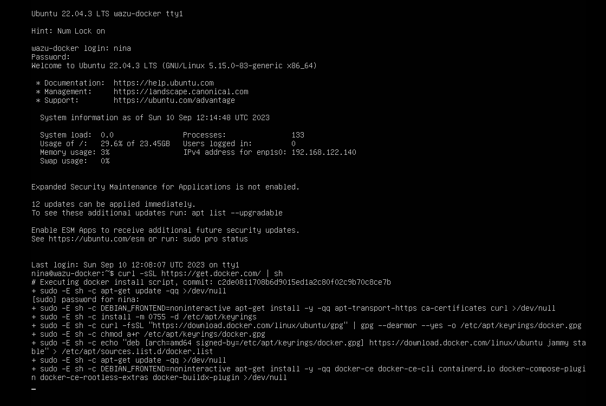
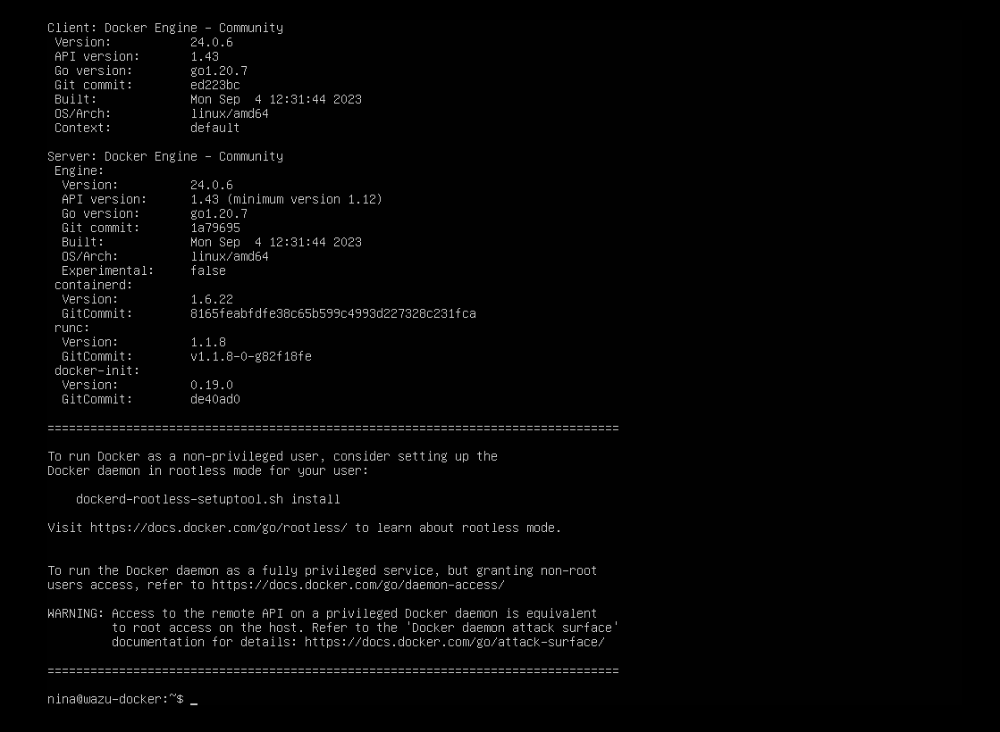
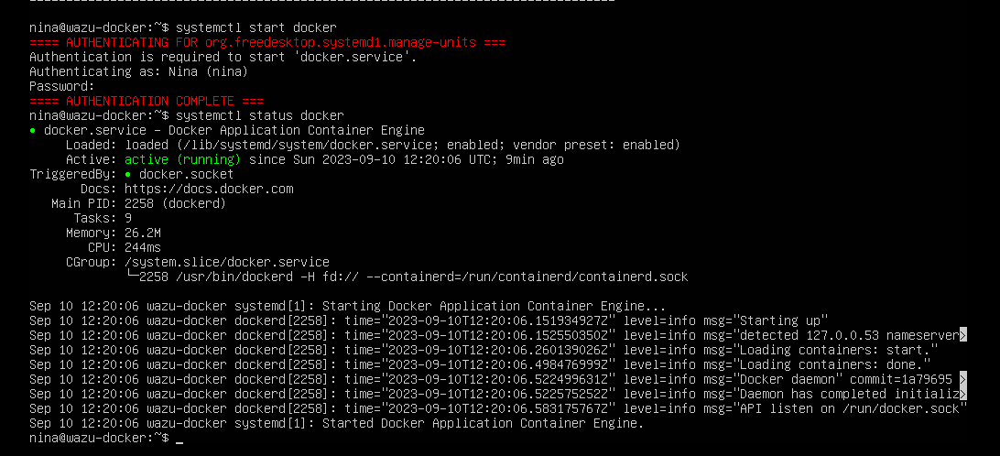
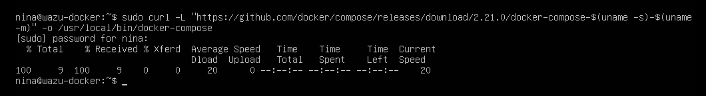
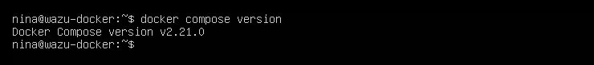
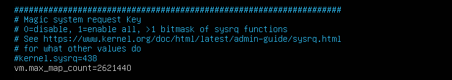
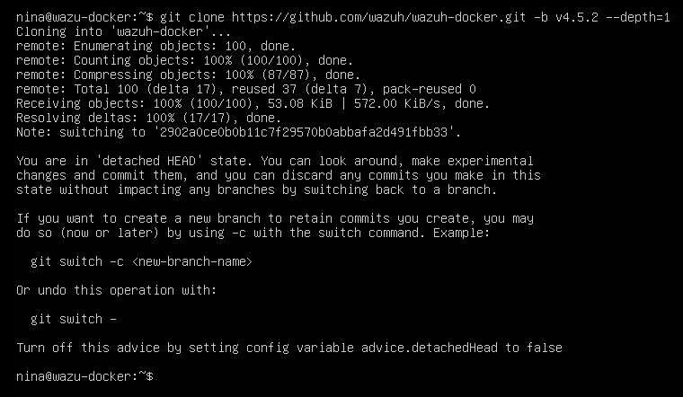
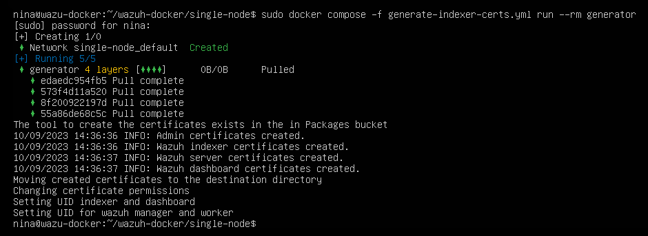
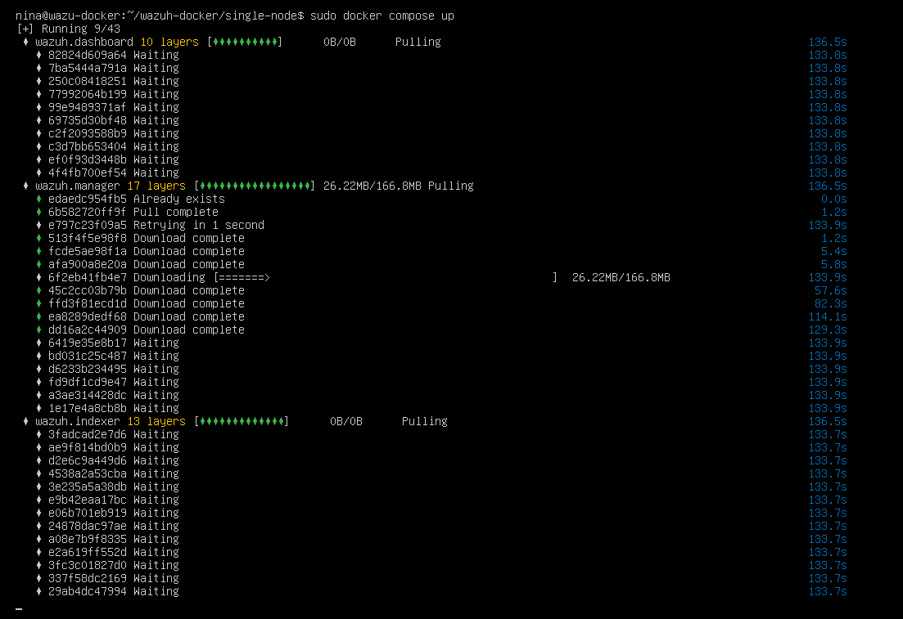

# Wazuh single-node stack with docker

The easiest stack uses dockers inside a single node in a VM, with Wazuh manager for ingesting logs, Elasticsearch to write logs and alerts to (storage backend), and Kibana as webUI to interact with the Elastick stack views, build a dashboard, and a user interface into all the alerts. Single-node, and locally, with self-signed certs.

## VM

A local QEMU/KVM guest, with 8GB RAM, 50GB memory and Ubuntu Server 22.04.3 without any additional packages. 

## Docker

Using the Docker install script to install Docker (alternatively, install it manually, it is available for all platforms):

```text
curl -sSL https://get.docker.com/ | sh
```



This takes awhile ...



Starting Docker and enable the service to run at boot time:

```text
systemctl start docker
```

Check it works:

```text
systemctl start docker
```



Permanently:

```text
systemctl enable docker
```

## Docker Compose

For running Wazuh, Elasticsearch, Kibana, Filebeat, and Nginx, with one command within the same environment so that all applications can talk to one another ([choose release version](https://github.com/docker/compose/releases)):

```text
sudo curl -L "https://github.com/docker/compose/releases/download/2.21.0/docker-compose-$(uname -s)-$(uname -m)" -o /usr/local/bin/docker-compose
```



Make executable and create a symlink:

```text
sudo chmod +x /usr/local/bin/docker-compose
sudo ln -s /usr/local/bin/docker-compose /usr/bin/docker-compose
```

Check it works:



## Preparing the VM

Configuring the VM host preferences to give at least 6 GB of memory to the host that creates the containers (this does not necessarily mean that it is used, but Elasticsearch requires it to work):

    sudo sysctl -w vm.max_map_count=262144


To set this value permanently, update the `vm.max_map_count` setting in `/etc/sysctl.conf`. Scroll down to the bottom and add it:

```text
sudo nano /etc/sysctl.conf
```



## Cloning the Wazuh repo

For cloning the Wazuh Docker repo, the Wazuh team have provided YAML files and scripts that can be used to quickly deploy a SIEM stack ([choose release version](https://github.com/wazuh/wazuh-docker/releases)):

```text
git clone https://github.com/wazuh/wazuh-docker.git -b v4.5.2 --depth=1
```



## Generate certs

Generating SSL Certs to secure Elasticsearch, Kibana, and Nginx traffic. 

### Self-signed

In the `wazuh-docker/single-node` directory:

    sudo docker compose -f generate-indexer-certs.yml run --rm generator



## Deployment

```text
docker compose up
```



The JobSweeper by default will keep going. Pointing my browser to the server gives:


Next up is a multi-node, with lrt's encrypt certificates, and agent enrollment.

## Resources

* [Wazuh docs: Wazuh Docker deployment](https://documentation.wazuh.com/current/deployment-options/docker/wazuh-container.html)
* [Docker Compose overview](https://docs.docker.com/compose/#features)
* [Get Docker](https://docs.docker.com/get-docker/)
