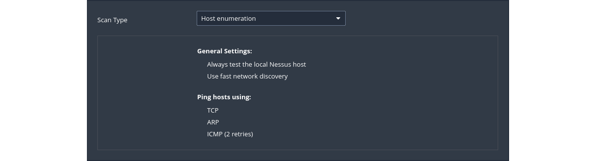
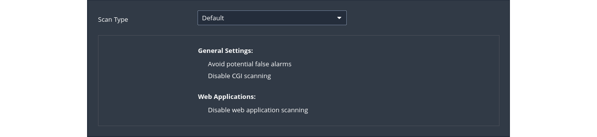
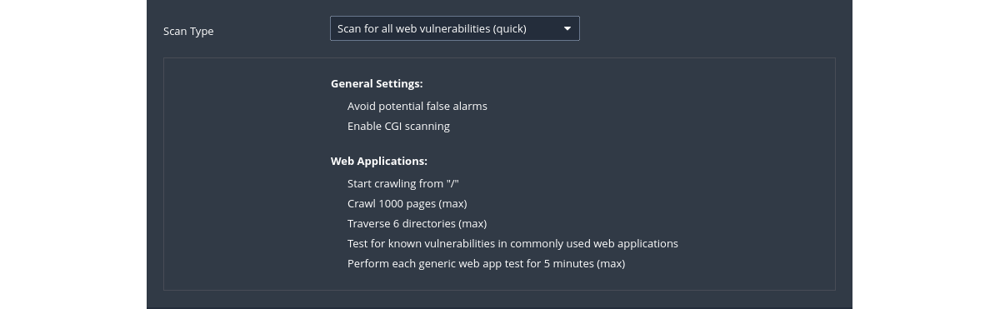

# Nessus

Nessus uses techniques similar to Nmap to find and report vulnerabilities. The results are presented in a GUI. It does not make assumptions when scanning, like assuming the web application is running on port 80 for instance.

## Installation on Debian/Kali and Ubuntu

1. Goto [Tenable: Nessus Essentials](https://www.tenable.com/products/nessus/nessus-essentials) and register an account 
to get an activation code.

2. Download the `Nessus-#.###.#-debian6_amd64.deb` file and install:

```text
sudo dpkg -i <the package_file.deb filename>
```

3. Start the Nessus Service:

```text
sudo /etc/init.d/nessusd start
```

4. Open up Firefox and goto https://localhost:8834/. You may be prompted with a security risk alert. Click Advanced... -> Accept the Risk and Continue.
5. Select the option `Nessus Essentials`.
6. Click the Skip button and enter the activation code from the email from Nessus.
7. Fill out the `Username` and `Password` fields.
8. Nessus will now install the plugins required for it to function. Takes a long time. Get some tea.
9. Log in with the account credentials made earlier. 

You can have 16 different (IP) targets with this license.

### Configuration

Scans can be configured based on different scan and policy templates. These templates will determine the settings 
that will be found within the scan policy settings. These are the general settings that can be accessed:

* [Basic](https://docs.tenable.com/nessus/Content/BasicSettings.htm): Specify security-related and organizational 
aspects of a scan or policy. These aspects will include the name of the scan, the targets of the scan, whether it is 
scheduled and who has access to it.
* [Discovery ](https://docs.tenable.com/nessus/Content/DiscoverySettings.htm) is where the ports to be 
scanned and the methods to be used in the discovery are set.
* Assessment is where and how the type of vulnerability scan to do is set. Nessus will check susceptibility of 
Web applications to attacks and other systems to brute-force attacks as well. This setting has sections allowing 
customisation of general scans to Windows, SCADA, Web applications, and even brute-force checks.
* Report sets how scan reports are generated and the information that should be included within them.
* [Advanced](https://docs.tenable.com/nessus/Content/AdvancedSettings.htm) sets scan efficiency and the operations of 
the scan, and allows for enabling scan debugging.

### Troubleshooting

#### Forgotten password

1. Navigate to: `cd /opt/nessus/sbin`
2. List users: `./nessuscli lsuser`
3. Reset the password for user `username`: `./nessuscli chpasswd username`

#### API access is disabled

Nessus displays warning "Nessus has detected that API access on this scanner is disabled" during usage. To fix this 
issue, stop the Nessus service, reset the configuration, restart Nessus and register again using the activation code.

1. Stop the Nessus service: `service nessusd stop`
2. Reset the configuration: `/opt/nessus/sbin/nessuscli fix --reset`
3. Start the Nessus service: `/etc/init.d/nessusd start`
4. Register Nessus using the activation code: `/opt/nessus/sbin/nessuscli fetch --register xxxx-xxxx-xxxx-xxxx-xxxx`
5. Login to Nessus to update plugins.

## Host discovery

| [](https://docs.tenable.com/nessus/10_4/Content/CreateAScan.htm) |
|:---------------------------------------------------------------------------------------------------------------:|
|                          Performs a simple scan to discover live hosts and open ports.                          |

### Default config

| [](https://docs.tenable.com/nessus/10_4/Content/ScanAndPolicyTemplates.htm#Discovery) |
|:--------------------------------------------------------------------------------------------------------------------------------------------------:|
|             [Scan And Policy Templates: Discovery](https://docs.tenable.com/nessus/10_4/Content/ScanAndPolicyTemplates.htm#Discovery)              |

### Scan

1. [Discovery Scan Settings](https://docs.tenable.com/nessus/Content/DiscoverySettings.htm) is where the ports to be 
scanned and the methods to be used in the discovery are set.
2. Launch scan
3. Confirm found vulnerabilities by running other vulnerability scanners against the targets to eliminate the possibility of any false positives.

## Basic network scan

|                           [](https://docs.tenable.com/nessus/10_4/Content/CreateAScan.htm)                            |
|:-----------------------------------------------------------------------------------------------------------------------------------------------------------------------:|
| Performs a full system scan that is suitable for any host. For example, this template can be used for <br> an internal vulnerability scan on an organisation's systems. |

### Default config

| [](https://docs.tenable.com/nessus/10_4/Content/ScanAndPolicyTemplates.htm#Vulnerabilities) |
|:-----------------------------------------------------------------------------------------------------------------------------------------------------------:|
|            [Scan And Policy Templates: Vulnerabilities](https://docs.tenable.com/nessus/10_4/Content/ScanAndPolicyTemplates.htm#Vulnerabilities)            |

### Example scan

1. Under `DISCOVERY` (on the left) set the `Scan Type` to cover ports `1-65535`
2. In `ADVANCED` change `Scan Type` to `Scan low bandwidth links`
3. Launch scan
4. Confirm found vulnerabilities by running other vulnerability scanners against the targets to eliminate the possibility of any false positives.

## Web application scan

| [](https://docs.tenable.com/nessus/10_4/Content/CreateAScan.htm) |
|:----------------------------------------------------------------------------------------------------------------------:|
|                                  Scan for published and unknown web vulnerabilities.                                   |

### Default config


| [](https://docs.tenable.com/nessus/10_4/Content/ScanAndPolicyTemplates.htm#Vulnerabilities) |
|:---------------------------------------------------------------------------------------------------------------------------------------------------------------:|
|              [Scan And Policy Templates: Vulnerabilities](https://docs.tenable.com/nessus/10_4/Content/ScanAndPolicyTemplates.htm#Vulnerabilities)              |

### Settings

Assessment is where and how the type of vulnerability scan to do is set. Nessus will check susceptibility of 
Web applications to attacks and other systems to brute-force attacks as well. This setting has sections allowing 
customisation of general scans to Windows, SCADA, Web applications, and even brute-force checks.

### Example scan

1. Select target
2. Select plugins 
   * CGI abuses - This plugin family checks for anything that is ‘CGI’ related, unless it is XSS (and only a XSS vulnerability), in which case it falls into the "CGI abuses : XSS" family. These checks use a combination of detection techniques, including checking version of the application and testing for the actual vulnerability. The attacks include software detection, information disclosure, XSS, SQLi, LFI, RFI, overflows and more.
   * CGI abuses : XSS - Specific CGI checks for reflective and persistent XSS vulnerabilities in common web applications.
   * Web servers - Plugins in this family detect approximately 1531 specific vulnerabilities in popular web servers, such as Apache, IIS and generic vulnerabilities associated with the HTTP protocol itself.
3. Launch scan
4. Confirm found vulnerabilities by running other vulnerability scanners against the targets to eliminate the possibility of any false positives.
