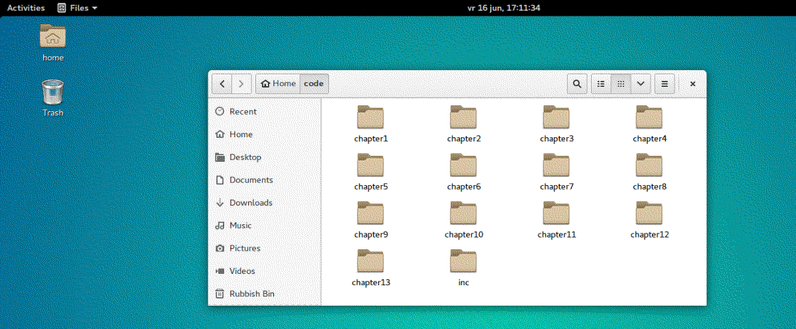

# Binary analysis VM

The [Binary Analysis book](https://practicalbinaryanalysis.com/) comes with a virtual machine that contains all the examples and software, making it possible to enjoy the challenge safely.

You can download it from [this torrent](https://tinyurl.com/ba-magnet) (or get link to it from the book site, I had to make a tinyurl to make a magnet link possible in markdown). The username and password for the VM are both "binary". [Why not VirtualBox](https://www.reddit.com/r/vmware/comments/rqxasq/why_not_virtual_box/). I have other KVM VM's as well, and running both KVM and VirtualBox in parallel leads to failures. 

## Installation on KVM

1. Download the `.ova`.
2. Copy, in case something goes wrong, and unpack:

```text
nina@tardis:~/Downloads$ cp binary.ova binary-analysis.ova
nina@tardis:~/Downloads$ ls
binary-analysis.ova  binary.ova
nina@tardis:~/Downloads$ tar -xvf binary-analysis.ova
binary.ovf
binary-disk001.vmdk
```

3. Convert the `.vmdk` to `.qcow2` (and rename):

```text
nina@tardis:~/Downloads$ qemu-img convert -p -f vmdk -O qcow2 binary-disk001.vmdk binary-analysis.qcow2
    (100.00/100%)
```

4. Move the `binary-analysis.qcow2` to `/var/lib/libvirt/images` (as root) and change ownership to `libvirt-qemu`. Change group to `kvm`.
5. Open the `binary.ovf` to look at the parameters (disk size 50 Gb is okay, 4096 RAM and 1 CPU, which you can change later to 2 CPU's if you wish).
6. Import in KVM, based on Ubuntu 16.04 (Include legacy to find it).
7. Set display resolution, and use `Left Ctrl + Left Alt` release focus (free mouse to host).

## Getting started



In the directory `~/code`, you will find one subdirectory per chapter, which contains all code samples and other relevant files for that chapter. There is also a directory called `~/code/inc` that contains common code used by programs in multiple chapters.

## Updates

Updating the OS or any software packages, for instance with `apt`, is not recommended because some of the pre-installed binary analysis toolkits have very specific expectations about the system. 

If you wish, update before the conversion to `qcow2`. I did not, and sofar it all works fine. 

