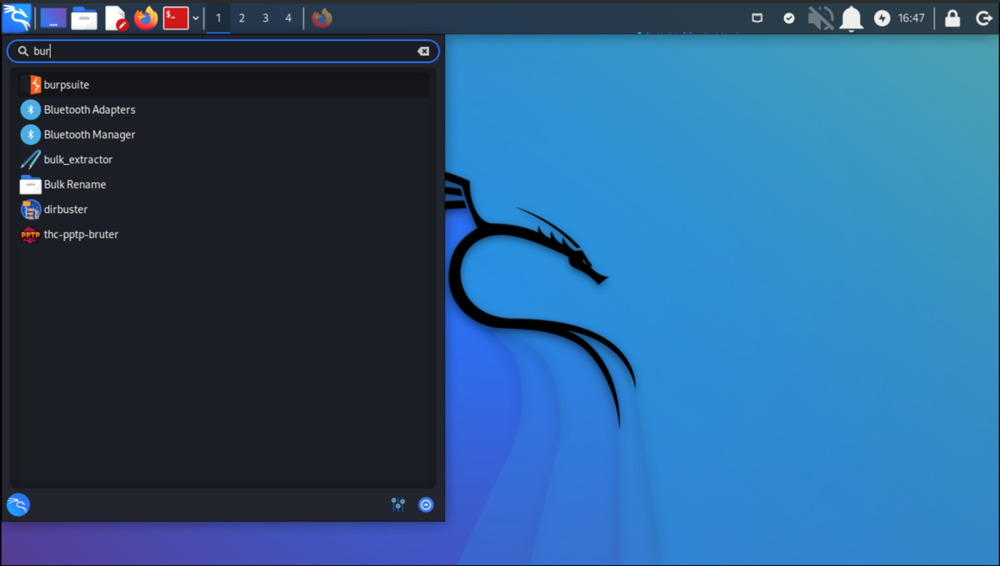

# Setting up Burp Suite (Kali)

[Burp Suite](https://portswigger.net/burp) is a web security testing toolkit offered as a graphical application. Burp Suite allows you to proxy and intercept, tamper with, replay, and inject web traffic. It offers plugins that automate attacks such as brute force, SQL injection, and attacks against session management. 

Burp Suite captures all the traffic from the targeted web application for analysis later. As a penetration tester, you can manipulate this process on your own and analyse the potential risks.

|  |
|:--:|
| Just click and click |

|  |
|:--:|
| Accept, and accept defaults |

And that's it.

## Resources

* [Burp Suite's web vulnerability scanner](https://portswigger.net/burp/vulnerability-scanner)
* [Burp documentation](https://portswigger.net/burp/documentation/desktop)
