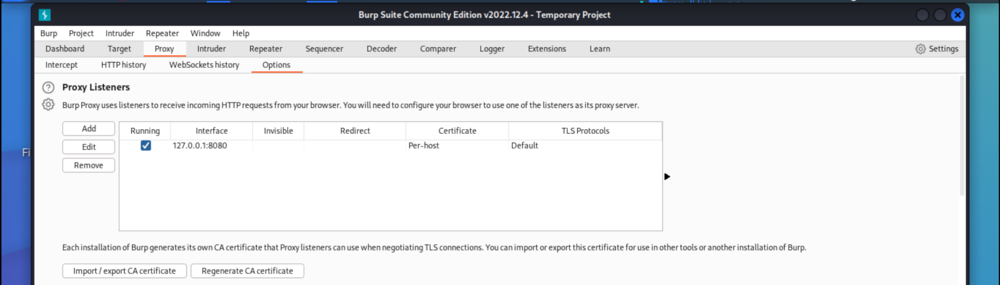

# Using firefox as proxy for Burp and Zap

## FoxyProxy

Foxy Proxy allows us to port switch between [Burp](burp.md) and [ZAP](zap.md), or completely turn off the proxy 
feature altogether.

|  |
|:--:|
| There are two versions. We only need the [basic version](https://addons.mozilla.org/en-US/firefox/addon/foxyproxy-basic/) |

|  |
|:--:|
| I set port `8080` for Burp |

|  |
|:--:|
| And port `8081` for Zap |

|  |
|:--:|
| Results look like this |

## Burp certificate

Install the certificates for both Burp and Zap to allow us to navigate HTTPS traffic without having encryption warnings.

Start up BurpSuite and go to Proxy tab -> Options. 

|  |
|:--:|
| You should see an entry for your localhost, `127.0.0.1`, and port `8080`.  These are the default settings for BurpSuite. If not, add.|

Select BurpSuite on FoxyProxy, and navigate to `http://burpsuite`:

|  |
|:--:|
| Download that cert |

Go to the options menu in Firefox and select Settings -> Privacy & Security. Nearly all the way down, in the Security section click on the `View Certificates` button. And from the `Authorities` tab, choose `Import`.

|  |
|:--:|
| Import the cert. |

|  |
|:--:|
| Select "Trust this CA to identify websites", and OK. |

Test that the certificate is imported correctly by visiting an HTTPS website with BurpSuite running and Burp being selected in FoxyProxy. It should load without errors.

## Zap certificate

|  |
|:--:|
| Zap, smart as it is when opening it up with Burp still running. |

|  |
|:--:|
| If not, set it in `Tools` -> `Options` -> `Local Servers/Proxies` |

To install the HTTPS certificates for Zap, within the Options menu, `Network` -> `Server Certificates`.

|  |
|:--:|
| Click `Save` |

Open Firefox `Settings` -> `Privacy & Security` menu -> `View Certificates` button -> `Authorities` tab, select `Import`. Trust this CA to identify websites.

To test it, have Zap running and FoxyProxy set to Zap. Go to any HTTPS website, and it should load without error.

