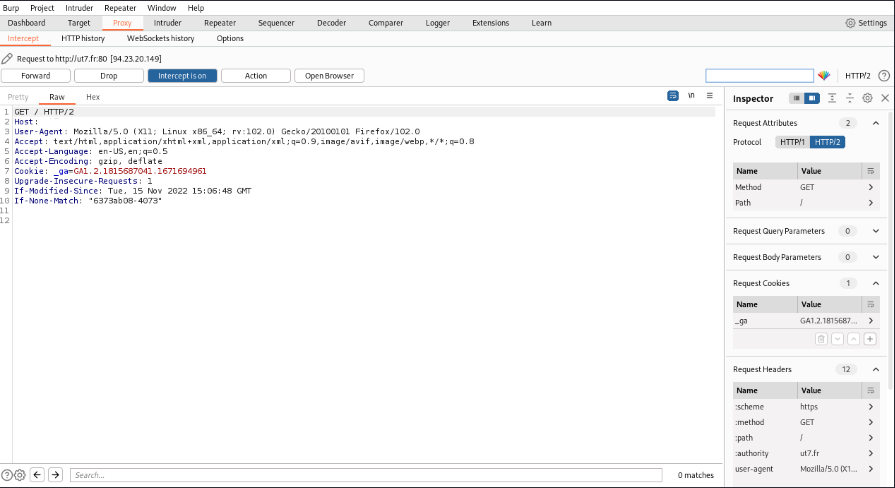
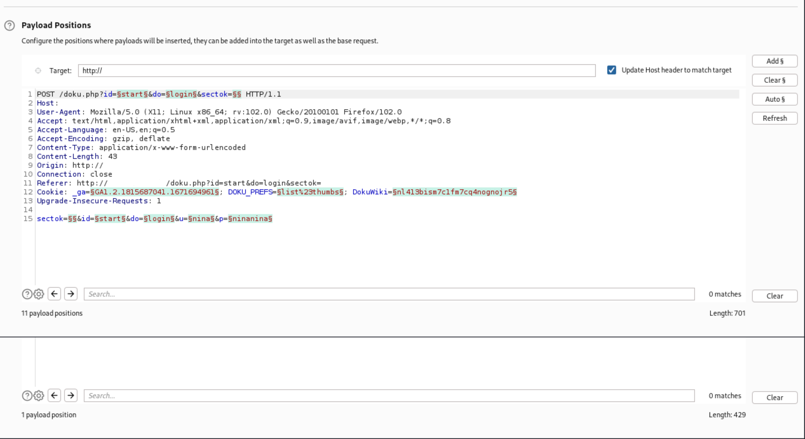
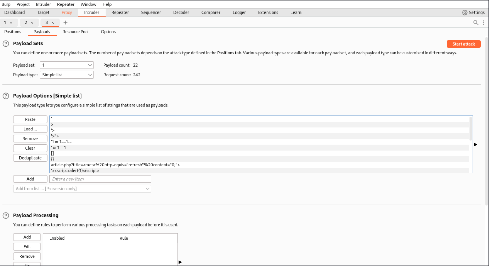
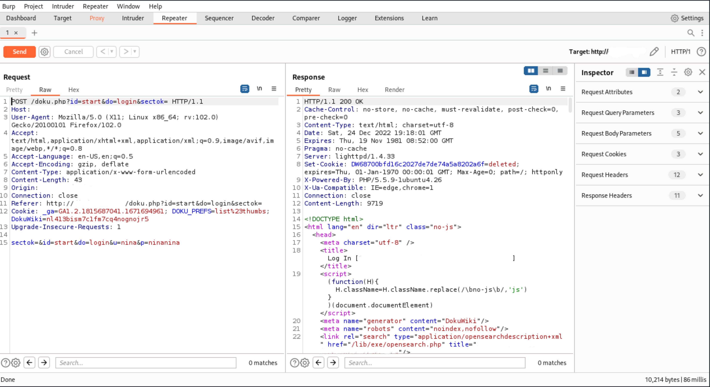

# HTTP proxies and traffic analysers

## Burp Suite

Burp Suite is an HTTP proxy, developed by [PortSwigger](https://portswigger.net/). There is a private and a free version. The free version lacks the scanner, and the private version is very expensive. Even with the missing scanner, as a proxy it is **the** basic tool for web application pentesting and bug bounty hunting.

### Proxy

If you go to the `Proxy` tab, you will see four buttons (`Forward`, `Drop`, `Intercept is on`, and `Action`), to control the requests: send and receive.  

|  |
|:--:|
| With `Forward`, `Drop`, `Intercept is on`, and `Action`, you can catch a request from your web<br> browser, analyse the content, modify it, and send it to the application. |

These are the most basic options, and the most frequently used buttons in any HTTP proxy. Burp can do more. 

### Intruder

The `Intruder` tab offers a tool that automates the sending of modified requests. This tool makes it possible to send a large number of requests with testing strings, lists of numbers, and real values.

|  |
|:--:|
| You can choose how the tool inserts the different values and where. |

|  |
|:--:|
| ** Create a [list with all the different types of testing strings](https://github.com/tymyrddin/scripts-webapp/blob/main/resources/strings-list.txt) to load in Intruder**. |

Then you can analyse the responses, looking for specific behaviours that could signal a vulnerability. 

### Repeater

|  |
|:--:|
| Burp's Repeater can be useful when interacting with the application's backend, modifying<br>a certain request. |

### Extensions

Extensions can be found in the [Burp app store](https://portswigger.net/bappstore) and can be added just like a JAR file. Most of them are free. 

The tool is awesome. But like said, the scanner is only available in the paid version which is expensive. 

## Zap

[ZAP](https://www.owasp.org/index.php/OWASP_Zed_Attack_Proxy_Project) evolved from Paro, and was developed by the OWASP project. It is very similar to Burp Suite and has a proxy, and tools such as a repeater, intruder, fuzzer, and a vulnerability analysis tool.

## Fiddler

[Fiddler](https://www.telerik.com/fiddler) is another HTTP proxy, and is more targeted at `.NET` developers. It does not have the assessment options like Burp or Zap, but is useful when analysing applications developed in `.NET`, where the binary format is difficult to understand by other proxies.

## Wireshark

During web application security assessments, it is not very common to analyse network traffic. And sometimes there are applications that use some components not running on the common `80` or `443` ports, and open other ports and services.

In this context, we can use it to analyse traffic between localhost and the internet, to understand a specific behaviour. 

Use flows to limit the scope. Create a filter by hostname, otherwise you will get flooded with other packets that are not part of the specific connection you are checking. To make host name filters work, enable DNS resolution in settings: Go to menu `View -> Name Resolution`, and enable the necessary options `Resolve * Addresses`. Look for the hostname and create a filter from it.

## Firebug

[Firebug](https://getfirebug.com/) is a Firefox extension commonly used by developers to detect errors during the execution of web applications. But it can also be used to assess applications and understand abnormal behaviours. Firebug is included in Firefox's Developer edition by default.

## Installing Firefox's Developer edition

1. Download the `firefox*.tar.bz2` file from [Mozilla’s website](https://www.mozilla.org/en-GB/firefox/developer/).
2. Open Terminal and navigate to the folder where the file is saved.
3. Copy `firefox*.tar.bz2` file to the `/opt` folder.

```text
sudo cp -rp firefox*.tar.bz2 /opt
```

4. Delete the downloaded `firefox*.tar.bz2` file.

```text
sudo rm -rf firefox*.tar.bz2
```

5. Navigate to the `/opt` directory.
6. Un-tar the `firefox*.tar.bz2` file.

```text
sudo tar xjf firefox*.tar.bz2
```

7. Delete the `firefox*.tar.bz2` file.

```text
sudo rm -rf firefox*.tar.bz2
```

8. Change ownership of the folder containing Firefox Developer Edition `/opt/firefox`:

```text
sudo chown -R $USER /opt/firefox
```

9. Create the shortcut:

```text
nano ~/.local/share/applications/firefox_dev.desktop
```

Content:

    [Desktop Entry]
    Name=Firefox Developer 
    GenericName=Firefox Developer Edition
    Exec=/opt/firefox/firefox %u
    Terminal=false
    Icon=/opt/firefox/browser/chrome/icons/default/default128.png
    Type=Application
    Categories=Application;Network;X-Developer;
    Comment=Firefox Developer Edition Web Browser.
    StartupWMClass=Firefox Developer Edition

10. Mark the launcher as trusted and make it executable.

```text
chmod +x ~/.local/share/applications/firefox_dev.desktop
```

11. To access Firebug, right-click on a website and select `Inspect Element`.

## Other useful developer tools

* [Firefox developer tools](https://firefox-dev.tools/)
* [Chrome DevTools](https://developer.chrome.com/docs/devtools/)