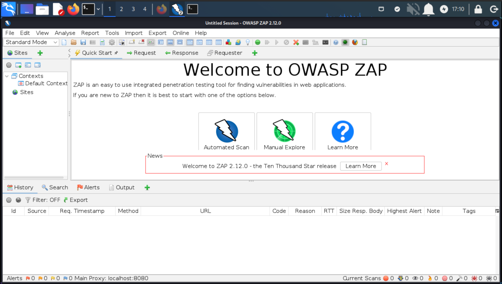

# Setting up ZAP (Kali)

OWASP ZAP was not preinstalled on my QEMU KALI VM.

## Installing Zap on Kali

    sudo apt install zaproxy

|  |
|:--:|
| Just click and click |

## Usage Zap

* Open the application through the terminal or by clicking on the icon
* Yes, persist the session
* Enter target web address in the green highlighted box and click attack
* Wait few minutes and analyse results

## Resources

* [ZAP Getting Started](https://www.zaproxy.org/getting-started/)
* [ZAP Baseline scan](https://www.zaproxy.org/docs/docker/baseline-scan/)
* [ZAP Full scan](https://www.zaproxy.org/docs/docker/full-scan/)